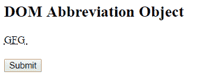
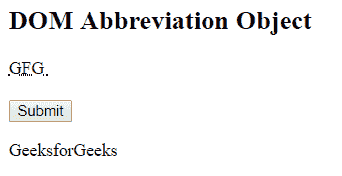
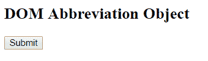

# HTML | DOM 缩写对象

> 原文:[https://www.geeksforgeeks.org/html-dom-abbreviation-object/](https://www.geeksforgeeks.org/html-dom-abbreviation-object/)

DOM 缩写对象用于表示 HTML abbr 元素。缩写元素由 getElementById()访问。

**例 1:**

```html
<!DOCTYPE html>
<html>
    <head>
        <title>
            HTML DOM Abbreviation Object
        </title>

        <script>
            function myGeeks() {
                var abbr = document.getElementById("sudo").title;
                document.getElementById("geeks").innerHTML = abbr;
            }
        </script>
    </head>

    <body>
        <h2>DOM Abbreviation Object</h2>

        <abbr id = "sudo" title="GeeksforGeeks">
            GFG
        </abbr><br><br>

        <button onclick = "myGeeks()">
            Submit
        </button>

        <p id = "geeks"></p>
    </body>
</html>                    
```

**输出:**
**之前点击按钮:**

**之后点击按钮:**


**示例 2:** 可以使用 document.createElement 方法创建缩写对象。

```html
<!DOCTYPE html>
<html>
    <head>
        <title>
            HTML DOM Abbreviation Object
        </title>

        <!-- script for Abbreviation Object -->
        <script>
            function myGeeks() {
                var w = document.createElement("ABBR");
                var f = document.createTextNode("GFG");
                w.setAttribute("title", "GeeksforGeeks");
                w.appendChild(f);
                document.getElementById("sudo").appendChild(w);
            }
        </script>
    </head>

    <body>
        <h2>DOM Abbreviation Object</h2>

        <button onclick = "myGeeks()">
            Submit
        </button>

        <p id = "sudo"></p>

    </body>
</html>                    
```

**输出:**
**之前点击按钮:**

**之后点击按钮:**


**支持的浏览器:***DOM 缩写对象*支持的浏览器如下:

*   谷歌 Chrome
*   微软公司出品的 web 浏览器
*   火狐浏览器
*   歌剧
*   旅行队