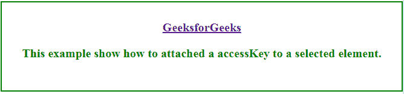
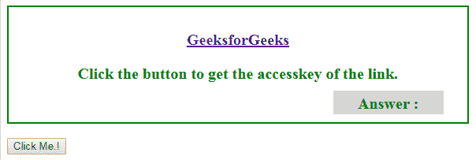
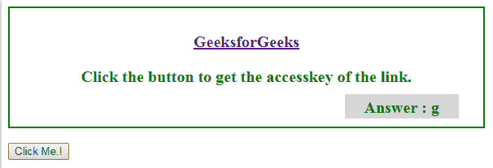

# HTML | DOM accessKey 属性

> 原文:[https://www.geeksforgeeks.org/html-dom-accesskey-property/](https://www.geeksforgeeks.org/html-dom-accesskey-property/)

**DOM 访问键**属性用于设置或返回元素的[访问键属性](https://www.geeksforgeeks.org/?p=261091)。

**语法:**

*   对于设置访问键:

    ```html
    HTMLElementObject.accessKey = value

    ```

*   要返回访问密钥:

    ```html
    HTMLElementObject.accessKey

    ```

**值:**

*   **字符:**用于指定快捷键的字符。

**返回值:**这将返回带有附加访问键的选定元素。

**示例-1:** 此示例显示了访问键是如何附加到选定元素的。

```html
<!DOCTYPE html>
<html>

<head>
    <title>
        HTML | DOM accessKey Property
    </title>
    <style>
        body {
            width: 90%;
            color: green;
            border: 2px solid green;
            height: 40%;
            font-weight: bold;
            text-align: center;
            padding: 30px;
            font-size: 20px;
        }
    </style>
</head>

<body>

    <a id="main" 
       href="https://www.geeksforgeeks.org">
      GeeksforGeeks
    </a>
    <br>

    <p>
        This example show how to attach 
        an accessKey to a selected element.
    </p>

    <script>
        document.getElementById("main").accessKey = "g";
    </script>

</body>

</html>
```

**输出:**

**点击前:**


**点击后:**


**示例-2:** 该示例显示了如何检查哪个访问键附加到选定的元素。

```html
<!DOCTYPE html>
<html>

<head>
    <title>
        HTML | DOM accessKey Property
    </title>
    <style>
        div {
            width: 80%;
            color: green;
            border: 2px solid green;
            height: 40%;
            font-weight: bold;
            text-align: center;
            padding: 30px;
            font-size: 20px;
        }

        #p1 {
            width: 130px;
            height: 20px;
            display: block;
            background-color: lightgrey;
            float: right;
            margin-top: -10px;
            padding: 5px;
        }

        #d {
            color: black;
        }
    </style>
</head>

<body>
    <div>
        <a id="main" accesskey="g" 
           href="https://www.geeksforgeeks.org">
          GeeksforGeeks
        </a>

        <p>
          Click the button to get the 
          accesskey of the link.
      </p>
        <p id="p1">Answer : <span id="d">
          </span>
        </p>
    </div>
    <br>

    <input type="button" onclick="myFunction()" 
           value="Click Me.!" />

    <script>
        function myFunction() {
            var gfg = 
                document.getElementById("main").accessKey;
            document.getElementById("d").innerHTML = gfg;
        }
    </script>

</body>

</html>
```

**输出:**

**点击前:**


**点击后:**


**注意:**快捷方式因浏览器而异。

*   **Mozilla firefix:**ALT+SHIFT+access key
*   **谷歌铬:** ALT + accesskey
*   **歌剧 15+：** ALT + 访问键
*   **Safari:** ALT + accesskey
*   **IE：** ALT + 访问密钥

**支持的浏览器:**以下是 *DOM accessKey Property* 支持的浏览器。

*   谷歌 Chrome
*   微软公司出品的 web 浏览器
*   火狐浏览器
*   歌剧
*   旅行队