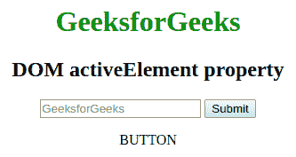

# HTML | DOM 活动元素属性

> 原文:[https://www . geesforgeks . org/html-DOM-active element-property/](https://www.geeksforgeeks.org/html-dom-activeelement-property/)

**DOM 活动元素属性**用于返回 HTML 文档中当前活动的元素。此属性是只读的。它给出了文档中聚焦元素对象的引用。
**语法:**

```html
document.activeElement
```

**返回值:**对文档中有焦点的元素对象的引用

**例:**

## 超文本标记语言

```html
<!DOCTYPE html>
<html>
    <head>
        <style>
            h1 {
                color:green;
            }
            body {
                text-align:center;
            }
        </style>
        <script>
            function GFG() {

                // Get Active Element using activeElement
                // property and assign it value equal to
                // to its tag
                var x = document.activeElement.tagName;
                document.getElementById("geeks").innerHTML = x;
            }
        </script>
    </head>
    <body onclick="GFG()">
        <h1>GeeksforGeeks</h1>
        <h2>DOM activeElement property</h2>
        <input type="text" placeholder="GeeksforGeeks">
        <button>Submit</button>
        <p id="geeks"></p>

    </body>
</html>                               
```

**输出:**



**支持的浏览器:**T2 DOM activeElement 属性支持的浏览器如下:

*   谷歌 Chrome 2.0
*   Internet Explorer 4.0
*   Firefox 3.0
*   歌剧 9.6
*   Safari 4.0