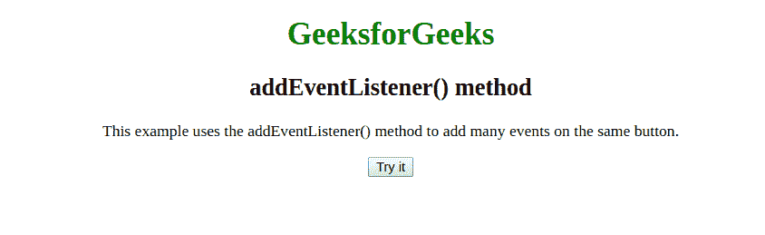
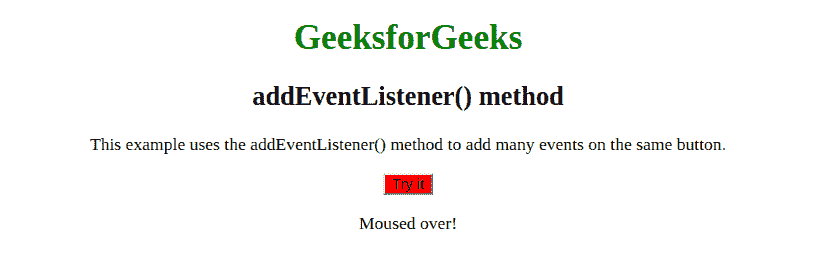
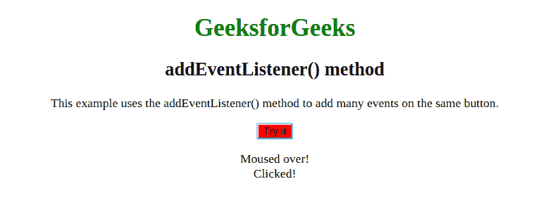
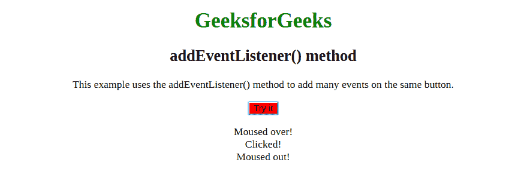

# HTML | DOM addEventListener()方法

> 原文:[https://www . geesforgeks . org/html-DOM-addeventlistener-method/](https://www.geeksforgeeks.org/html-dom-addeventlistener-method/)

**addEventListener()** 方法将事件处理程序附加到指定的元素。

**语法:**

```html
element.addEventListener(event, function, useCapture)
```

**注意:**第三个参数使用捕获通常设置为 false，因为它没有被使用。

下面的程序说明了 DOM addEventListener():

**示例:**

```html
<!DOCTYPE html>
<html>

<head>
    <title>DOM Location host Property</title>
    <style>
        h1 {
            color: green;
        }

        h2 {
            font-family: Impact;
        }

        body {
            text-align: center;
        }
    </style>
</head>

<body>
    <h1>GeeksforGeeks</h1>
    <h2>addEventListener() method</h2>

    <p>
     This example uses the addEventListener() 
     method to add many events on the same 
     button.
    </p>

    <button id="myBtn">Try it</button>

    <p id="demo"></p>

    <script>
        var x = document.getElementById("myBtn");
        x.addEventListener("mouseover", myFunction);
        x.addEventListener("click", mySecondFunction);
        x.addEventListener("mouseout", myThirdFunction);

        function myFunction() {
            document.getElementById("demo").innerHTML += "Moused over!<br>"
            this.style.backgroundColor = "red"
        }

        function mySecondFunction() {
            document.getElementById("demo").innerHTML += "Clicked!<br>"
        }

        function myThirdFunction() {
            document.getElementById("demo").innerHTML += "Moused out!<br>"
        }
    </script>

</body>

</html>                    
```

**输出:**

*   **最初:**
    
*   **鼠标悬停事件:**
    
*   **鼠标点击事件:**
    
*   **鼠标退出事件:**
    

**支持的浏览器**:以下是*位置主机属性*支持的浏览器:

*   谷歌 Chrome
*   微软公司出品的 web 浏览器
*   火狐浏览器
*   歌剧
*   旅行队