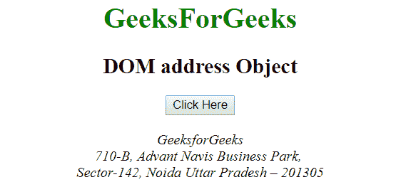

# HTML | DOM 地址对象

> 原文:[https://www.geeksforgeeks.org/html-dom-address-object/](https://www.geeksforgeeks.org/html-dom-address-object/)

**DOM 地址对象**用于表示 HTML <地址>元素。可以使用 **getElementById()** 方法访问地址元素。

**语法:**

```html
document.getElementById("id"); 
```

其中‘id’是分配给**地址**标签的 ID。

**示例-1:** 在下面的程序中，地址元素被访问，并且地址元素内的文本颜色被改变。

## 超文本标记语言

```html
<!DOCTYPE html>
<html>
<body>
    <center>
        <h1 style = "color:green;" >
          GeeksForGeeks
        </h1>
        <h2>DOM address Object</h2>

        <button onclick="Geeks()">Click Here</button><br><br>

        <address id="s">GeeksforGeeks<br>
            710-B, Advant Navis Business Park, <br>
            Sector-142, Noida Uttar Pradesh – 201305
        </address>

        <script>
        function Geeks() {
          var txt = document.getElementById("s");
          txt.style.color = "green";
        }
        </script>
</body>
</html>
```

**输出:**
**点击按钮前:**



**点击按钮后:**


**示例-2:** 地址对象可以使用**文档.创建元素**方法创建。

## 超文本标记语言

```html
<!DOCTYPE html>
<html>
<body>
<center>
        <h1 style = "color:green;" >
          GeeksForGeeks
        </h1>

        <h2>DOM address Object</h2>

        <button onclick="Geeks()">Click Here!</button><br><br>

        <div><span id="p"></span></div>

        <script>
        function Geeks() {
            var x = document.createElement("ADDRESS");
            var t = document.createTextNode("Baker street, 221B, UK");

            x.appendChild(t);

            document.getElementById("p").appendChild(x);
        }
        </script>
</body>
</html>
```

**输出:**
**点击按钮前:**


**点击按钮后:**


**支持的浏览器**:HTML DOM Address 对象支持的浏览器如下:

*   谷歌 Chrome
*   微软公司出品的 web 浏览器
*   火狐浏览器
*   歌剧
*   旅行队