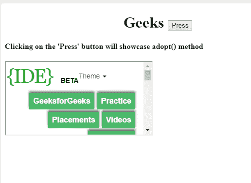
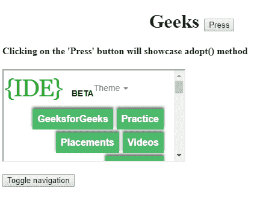

# HTML | DOM 采用 Node()方法

> 原文:[https://www.geeksforgeeks.org/html-dom-adoptnode-method/](https://www.geeksforgeeks.org/html-dom-adoptnode-method/)

这个 **DOM 收养节点()**方法是用来**从另一个文档中收养一个节点**。可以采用所有节点类型。可以采用所有子节点以及原始节点。**采用节点()方法**返回节点对象。

**语法:**

```html
document.adoptNode(node)
```

**参数值:** DOM 收养节点()方法只包含一个下述方法。

*   **节点:**需要任意类型的节点。

**返回值:**返回一个节点对象，代表采用的节点。

**示例:**

## 超文本标记语言

```html
<!DOCTYPE html>
<html>

<body>
    <h1><center>Geeks
<button onclick="adopt()">Press</button>
</center> </h1>

        <h4>Clicking on the 'Press' button
will showcase adopt() method</h4>

    <p id="gfg">

        <iframe
    src="https://ide.geeksforgeeks.org/tryit.php">
        </iframe>

    </p>

    <script>
        function adopt() {
            var frame =
              document.getElementsByTagName(
                "iframe")[0];

            var h =
    frame.contentWindow.document.getElementsByTagName(
                "button")[0];

            // 'h' is button type adopted node.
            var x = document.adoptNode(h);
            document.body.appendChild(x);
        }
    </script>

</body>

</html>
```

**输出:**
按下按钮前:



按下按钮后:



**注意:**全部采用子节点。

**浏览器支持:**下面列出了 **DOM 收养节点()**方法支持的浏览器:

*   谷歌 Chrome
*   微软公司出品的 web 浏览器
*   火狐浏览器
*   歌剧
*   旅行队