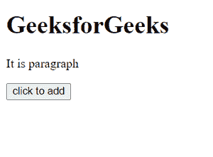
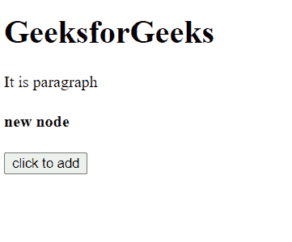
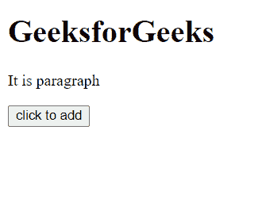
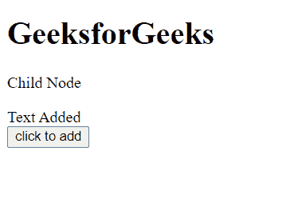

# HTML | DOM 后()方法

> 原文:[https://www.geeksforgeeks.org/html-dom-after-method/](https://www.geeksforgeeks.org/html-dom-after-method/)

方法后的**用于在**子节点的** **父节点的子列表中插入一组**节点**对象或 **HTML DOMString** 对象。**在我们提到的**子节点之后插入**元素。**

**语法:**

```html
ChildNode.after(Node or DOMString)
```

**参数:**该方法接受如上所述的单个参数，描述如下:

*   **节点:**它是一组**节点**对象或 **HTML DOMString** 对象，必须插入到子节点之后。

**示例 1:** 在本例中，我们将在子元素之后向 DOM 插入一个元素节点。

## 超文本标记语言

```html
<!DOCTYPE html>
<html>

<head>
    <title>
        HTML | DOM after() Method
    </title>
</head>

<body>
    <div id="div">
        <h1>GeeksforGeeks</h1>
        <p id="p">Child Node</p>
    </div>

    <button onclick="add()">click to add</button>
    <script>
        // Get the parent element
        var parent = document.getElementById("div");
        console.log(parent);

        // Get the element to add after
        var para = document.getElementById("p");

        // Function to add the element
        function add() {

            // Create a new element to add
            const div = document.createElement("div");
            div.innerHTML = "<h4>new node</h4>";

            // Insert the created element
            para.after(div);
        }
        console.log(parent.outerHTML);
    </script>
</body>

</html>
```

**输出:**

在输出中，可以看到点击按钮后，在< p >元素的子元素后插入了一个**新节点。**

*   **点击按钮前:**

    

*   **点击按钮后:**

    

**示例 2:** 在本例中，我们将在子节点后插入一些文本。

## 超文本标记语言

```html
<!DOCTYPE html>
<html>

<head>
    <title>
        HTML | DOM after() Method
    </title>
</head>

<body>
    <div id="div">
        <h1>GeeksforGeeks</h1>
        <p id="p">Child Node</p>
    </div>

    <button onclick="add()">
        click to add
    </button>

    <script>
        // Get the parent element
        var parent = document.getElementById("div");
        console.log(parent)

        // Get the element to add after
        var para = document.getElementById("p");

        // Function to add the element
        function add() {

            // Insert a text element
            // after this element
            para.after("Text Added");
        }
        console.log(parent.outerHTML);
    </script>
</body>

</html>
```

**输出:**

*   **点击按钮前:**

    

*   **点击按钮后:**

    

**支持的浏览器:**方法后 **DOM 支持的浏览器如下:**

*   谷歌 Chrome
*   边缘
*   火狐浏览器
*   歌剧