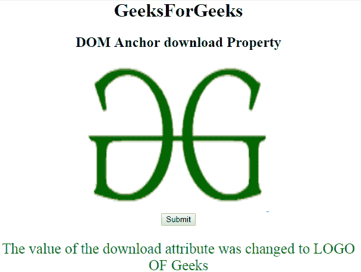

# HTML | DOM 锚点下载属性

> 原文:[https://www . geesforgeks . org/html-DOM-anchor-download-property/](https://www.geeksforgeeks.org/html-dom-anchor-download-property/)

HTML DOM 中的 **DOM 锚点下载属性**用于**设置**或**返回** *一个链接的下载属性值*。**下载属性**用于指定用户点击时要下载的目标链接。

**语法:**

*   它返回下载属性。

    ```html
    anchorObject.download
    ```

*   它用于设置下载属性。

    ```html
    anchorObject.download = filename
    ```

**属性值:**

*   **文件名:**指定需要下载的文件的名称。

**返回值:**返回一个代表下载文件名称的字符串值。

**示例-1:** 本示例返回下载属性。

```html
<!DOCTYPE html>
<html>

<head>
    <title>
        HTML DOM Anchor download Property
    </title>
</head>

<body>
    <center>
        <h1>GeeksForGeeks</h1>

        <h2>
          DOM Anchor download Property
      </h2>

        <a href=
    "http://www.example.com:4097/test.htm#part2" 
           id="GFG"
           rel="nofollow" 
           hreflang="en-us"
           target="_self" 
           download="GFG_Logo">

            
        </a>

        <BR>
        <button onclick="myGeeks()">
          Submit
      </button>

        <p id="sudo" 
           style="color:green;
                  font-size:25px;">
      </p>

        <script>
            function myGeeks() {
                var x = 
                    document.getElementById(
                      "GFG").download;

                document.getElementById(
                  "sudo").innerHTML = x;
            }
        </script> "
    </center>
</body>

</html>
```

**输出:**

**点击按钮前:**

**点击按钮后:**


**示例-2 :** 本示例设置下载属性。

```html
<!DOCTYPE html>
<html>

<head>
    <title>
        HTML DOM Anchor download Property
    </title>
</head>

<body>
    <center>
        <h1>GeeksForGeeks</h1>

        <h2>
          DOM Anchor download Property
      </h2>

        <a href=
  "http://www.example.com:4097/test.htm#part2" 
           id="GFG"
           rel="nofollow"
           hreflang="en-us" 
           target="_self" 
           download="GFG_Logo">

            
        </a>

        <BR>
        <button onclick="myGeeks()">
          Submit
      </button>

        <p id="sudo" 
           style="color:green;
                  font-size:25px;">
      </p>

        <script>
            function myGeeks() {
                var x = 
                    document.getElementById(
                      "GFG").download = "LOGO OF Geeks";

                document.getElementById(
                  "sudo").innerHTML = 
                  "The value of the download attribute "+
                  "was changed to " + x;
            }
        </script> "
    </center>
</body>

</html>
```

**输出:**
**点击
按钮前:**


**点击按钮后:**


**支持的浏览器:****DOM Anchor 下载属性**支持的浏览器如下:

*   谷歌 Chrome
*   Internet Explorer 10.0 +
*   火狐浏览器
*   歌剧
*   旅行队