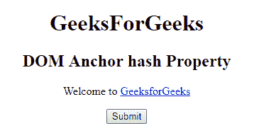
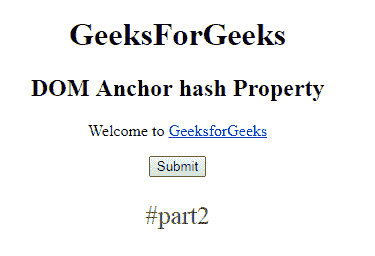
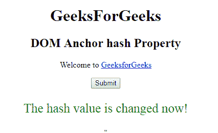

# HTML | DOM 锚点哈希属性

> 原文:[https://www . geesforgeks . org/html-DOM-anchor-hash-property/](https://www.geeksforgeeks.org/html-dom-anchor-hash-property/)

HTML DOM 中的 **DOM 锚点哈希属性**用于**设置**或**返回***href 属性值的锚点部分*。**锚点部分**是哈希符号 **(#)后的网址部分。**

**语法:**

*   它返回哈希属性。

    ```html
    anchorObject.hash
    ```

*   它用于设置哈希属性。

    ```html
    anchorObject.hash = anchorname
    ```

**属性值:**包含值即**锚点名称**，用于指定网址的锚点部分。

**返回值:**它返回一个字符串值，该值代表包含哈希符号(#)的网址的锚部分。

**示例-1:** 本示例返回哈希属性。

```html
<!DOCTYPE html>
<html>

<head>
    <title>
        HTML DOM Anchor hash Property
    </title>
</head>

<body>
    <center>
        <h1>GeeksForGeeks</h1>

        <h2>
          DOM Anchor hash Property
      </h2>

        <p>Welcome to
            <a href=
      "http://www.example.com:4097/test.htm#part2" 
               id="GFG"
               rel="nofollow" 
               hreflang="en-us" 
               target="_self"> 
                GeeksforGeeks 
            </a>
        </p>

        <button onclick="myGeeks()">
          Submit
      </button>

        <p id="sudo"
           style="color:green;
                  font-size:25px;">
      </p>

        <script>
            function myGeeks() {

                var x = 
                    document.getElementById(
                      "GFG").hash;

                document.getElementById(
                  "sudo").innerHTML = x;
            }
        </script> "
    </center>
</body>

</html>
```

**输出:**
**点击按钮前:**

**点击按钮后:**


**示例-2 :** 本示例设置哈希属性。

```html
<!DOCTYPE html>
<html>

<head>
    <title>
        HTML DOM Anchor hash Property
    </title>
</head>

<body>
    <center>
        <h1>GeeksForGeeks</h1>

        <h2>
          DOM Anchor hash Property
      </h2>

        <p>Welcome to
            <a href=
      "http://www.example.com:4097/test.htm#part2" 
               id="GFG" 
               rel="nofollow" 
               hreflang="en-us" 
               target="_self"> 
                GeeksforGeeks 
            </a>
        </p>

        <button onclick="myGeeks()">
          Submit
      </button>

        <p id="sudo" 
           style="color:green;
                  font-size:25px;">
      </p>

        <script>
            function myGeeks() {
                var x = 
                    document.getElementById("GFG").hash =
                    "The hash value is changed now!";

                document.getElementById("sudo").innerHTML = 
                  x;
            }
        </script> "
    </center>
</body>

</html>
```

**输出:**

**点击按钮前:**

**点击按钮后:**


**支持的浏览器:****DOM Anchor 哈希属性**支持的浏览器如下:

*   谷歌 Chrome
*   Internet Explorer 10.0 +
*   火狐浏览器
*   歌剧
*   旅行队