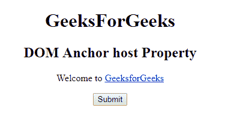

# HTML | DOM 锚点主机属性

> 原文:[https://www . geesforgeks . org/html-DOM-anchor-host-property/](https://www.geeksforgeeks.org/html-dom-anchor-host-property/)

HTML DOM 中的 **DOM 锚点主机属性**用于**设置**或**返回***href 属性值的主机名和 post 部分*。

**语法:**

*   它返回宿主属性。

    ```html
    anchorObject.host
    ```

*   它用于设置主机属性。

    ```html
    anchorObject.host = hostname:port
    ```

**属性值:**它包含值**主机名:端口**，该值指定了一个网址的主机名和端口号。

**返回值:**返回一个代表域名和网址端口号的字符串值。

**示例:**本示例返回主机属性。

```html
<!DOCTYPE html>
<html>

<head>
    <title>
        HTML DOM Anchor host Property
    </title>
</head>

<body>
    <center>
        <h1>GeeksForGeeks</h1>

        <h2>
          DOM Anchor host Property
      </h2>

        <p>Welcome to
            <a href=
   "http://www.example.com:4097/test.htm#part2"
               id="GFG"
               rel="nofollow" 
               hreflang="en-us"
               target="_self"> 
                GeeksforGeeks 
            </a>
        </p>

        <button onclick="myGeeks()">
          Submit
      </button>

        <p id="sudo"
           style="color:green;
                  font-size:25px;">
      </p>

        <script>
            function myGeeks() {

                var x = 
                    document.getElementById(
                      "GFG").host;

                document.getElementById(
                  "sudo").innerHTML = x;
            }
        </script> "
    </center>
</body>

</html>
```

**输出:**
**点击按钮前:**


**点击按钮后:**


**示例-2:** 本示例设置主机属性。

```html
<!DOCTYPE html>
<html>

<head>
    <title>
        HTML DOM Anchor host Property
    </title>
</head>

<body>
    <center>
        <h1>GeeksForGeeks</h1>

        <h2>
          DOM Anchor host Property
      </h2>

        <p>Welcome to
            <a href=
    "http://www.example.com:4097/test.htm#part2" 
               id="GFG"
               rel="nofollow"
               hreflang="en-us" 
               target="_self"> 
                GeeksforGeeks 
            </a>
        </p>

        <button onclick="myGeeks()">
          Submit
      </button>

        <p id="sudo" 
           style="color:green;
                  font-size:25px;">
      </p>

        <script>
            function myGeeks() {
                var x = 
                    document.getElementById("GFG").host =
                    "www.geeksforgeeks.org:443";

                document.getElementById(
                  "sudo").innerHTML = x;
            }
        </script> "
    </center>
</body>

</html>
```

**输出:**
**点击按钮前:**

**点击按钮后:**


**支持的浏览器:****DOM Anchor 主机属性**支持的浏览器如下:

*   谷歌 Chrome
*   Internet Explorer 10.0 +
*   火狐浏览器
*   歌剧
*   旅行队