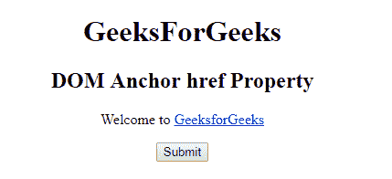
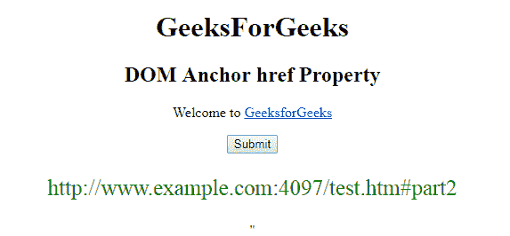
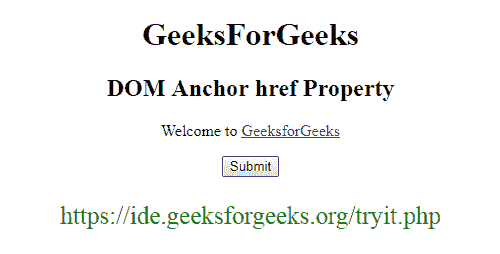

# HTML | DOM 锚点 href 属性

> 原文:[https://www . geesforgeks . org/html-DOM-anchor-href-property/](https://www.geeksforgeeks.org/html-dom-anchor-href-property/)

HTML DOM 中的 **DOM 锚点 href 属性**用于**设置**或**返回** *链接的 href 属性值*。href 属性用于指定链接的目的地。

**语法:**

*   它返回 href 属性。

    ```html
    anchorObject.href
    ```

*   它用于设置 href 属性。

    ```html
    anchorObject.href = URL 
    ```

**属性值:**包含指定链接网址的值，即**网址**。

*   **绝对 URL:** 指向另一个网站。
*   **相对 URL:** 它指向网站内的一个文件。
*   **锚点 URL:** 它指向页面内的一个锚点。

**返回值:**返回一个字符串值，代表包括协议在内的链接的整个网址。

**示例-1:** 本示例返回 href 属性。

```html
<!DOCTYPE html>
<html>

<head>
    <title>
        HTML DOM Anchor href Property
    </title>
</head>

<body>
    <center>
        <h1>
          GeeksForGeeks
      </h1>

        <h2>
          DOM Anchor href Property
      </h2>

        <p>Welcome to
            <a href=
   "http://www.example.com:4097/test.htm#part2" 
               id="GFG" 
               rel="nofollow" 
               hreflang="en-us" 
               target="_self"> 
                GeeksforGeeks 
            </a>
        </p>

        <button onclick="myGeeks()">
          Submit
      </button>

        <p id="sudo"
           style="color:green;
                  font-size:25px;">
      </p>

        <script>
            function myGeeks() {

                var x = 
                    document.getElementById(
                      "GFG").href;

                document.getElementById(
                  "sudo").innerHTML = x;
            }
        </script> "
    </center>
</body>

</html>
```

**输出:**
**点击按钮前:**


**点击按钮后:**


**示例-2 :** 本示例设置 href 属性。

```html
<!DOCTYPE html>
<html>

<head>
    <title>
        HTML DOM Anchor href Property
    </title>
</head>

<body>
    <center>
        <h1>
          GeeksForGeeks
      </h1>

        <h2>
          DOM Anchor href Property
      </h2>

        <p>Welcome to
            <a href=
    "http://www.example.com:4097/test.htm#part2" 
               id="GFG" 
               rel="nofollow" 
               hreflang="en-us" 
               target="_self"> 
                GeeksforGeeks 
            </a>
        </p>

        <button onclick="myGeeks()">
          Submit
      </button>

        <p id="sudo"
           style="color:green;
                  font-size:25px;">
      </p>

        <script>
            function myGeeks() {

                var x =
                    document.getElementById("GFG").href = 
                    "https://ide.geeksforgeeks.org/tryit.php";

                document.getElementById("sudo").innerHTML = x;
            }
        </script> "
    </center>
</body>

</html>
```

**输出:**
**点击按钮前:**


**点击按钮后:**


**支持的浏览器:**T2 DOM Anchor href 属性支持的浏览器如下:

*   谷歌 Chrome
*   Internet Explorer 10.0 +
*   火狐浏览器
*   歌剧
*   旅行队