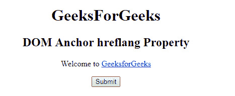
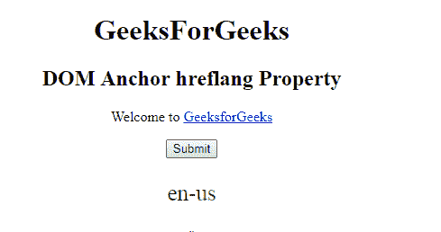
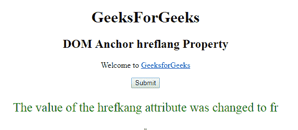

# HTML | DOM 锚点 hreflang 属性

> 原文:[https://www . geesforgeks . org/html-DOM-anchor-hre flang-property/](https://www.geeksforgeeks.org/html-dom-anchor-hreflang-property/)

HTML DOM 中的 **DOM 锚点 hreflang 属性**用于**设置**或**返回** *一个 URL 或链接的 hreflang 属性的值*。 **hreflang 属性**用于指定链接文档的语言。

**语法:**

*   它返回 hreflang 属性。

    ```html
    anchorObject.hreflang
    ```

*   它用于设置 hreflang 属性。

    ```html
    anchorObject.hreflang = languagecode
    ```

**属性值:**

*   **languagecode:** 指定代表链接文档语言的两个字母代码。

**返回值:**返回一个字符串值，代表链接文档的语言。

**示例-1:** 本示例返回 hreflang 属性。

```html
<!DOCTYPE html>
<html>

<head>
    <title>
        HTML DOM Anchor hreflang Property
    </title>
</head>

<body>
    <center>
        <h1>
          GeeksForGeeks
      </h1>

        <h2>
          DOM Anchor hreflang Property
      </h2>

        <p>Welcome to
            <a href=
  "http://www.example.com:4097/test.htm#part2" 
               id="GFG" 
               rel="nofollow" 
               hreflang="en-us" 
               target="_self"> 
                GeeksforGeeks 
            </a>
        </p>

        <button onclick="myGeeks()">
          Submit
      </button>

        <p id="sudo"
           style="color:green;
                  font-size:25px;">
      </p>

        <script>
            function myGeeks() {

                var x = 
                    document.getElementById(
                      "GFG").hreflang;

                document.getElementById(
                  "sudo").innerHTML = x;
            }
        </script> "
    </center>
</body>

</html>
```

**输出:**

**点击按钮前:**


**点击按钮后:**


**示例-2:** 本示例设置 hreflang 属性。

```html
<!DOCTYPE html>
<html>

<head>
    <title>
        HTML DOM Anchor hreflang Property
    </title>
</head>

<body>
    <center>
        <h1>
          GeeksForGeeks
      </h1>

        <h2>
          DOM Anchor hreflang Property
      </h2>

        <p>Welcome to
            <a href=
  "http://www.example.com:4097/test.htm#part2" 
               id="GFG" 
               rel="nofollow" 
               hreflang="en-us" 
               target="_self"> 
                GeeksforGeeks 
            </a>
        </p>

        <button onclick="myGeeks()">
          Submit
      </button>

        <p id="sudo" 
           style="color:green;
                  font-size:25px;">
      </p>

        <script>
            function myGeeks() {

                var x = 
                    document.getElementById(
                      "GFG").hreflang = "fr";

                document.getElementById(
                  "sudo").innerHTML = 
                  "The value of the hrefkang attribute"+
                  " was changed to " + x;
            }
        </script> "
    </center>
</body>

</html>
```

**输出:**

**点击按钮前:**


**点击按钮后:**


**支持的浏览器:****DOM Anchor hreflang 属性**支持的浏览器如下:

*   谷歌 Chrome
*   Internet Explorer 10.0 +
*   火狐浏览器
*   歌剧
*   旅行队