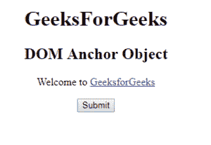
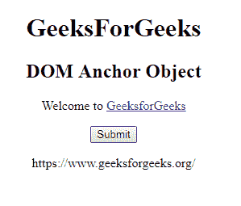
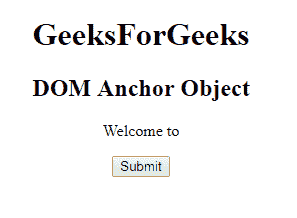
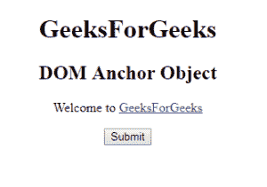

# HTML | DOM 锚点对象

> 原文:[https://www.geeksforgeeks.org/html-dom-anchor-object/](https://www.geeksforgeeks.org/html-dom-anchor-object/)

HTML DOM 中的锚点对象用来表示

**语法:**

```html
document.getElementById("ID"); 
```

其中标识被分配给锚标签。

**属性值:**

*   **字符集:**用于设置或返回字符集。HTML 5 不支持。
*   **下载:**用于用户点击时设置或返回要下载的目标链接。
*   **hreflang:** 用于设置或返回链接文档的语言。
*   **介质:**用于设置或退回链接的介质。
*   **坐标:**用于设置或返回链接的坐标。
*   **名称:**用于设置或返回锚点名称。
*   **rel:** 用于设置或返回当前单据与链接单据的关系。
*   **形状:**用于设置或返回链接的形状。
*   **类型:**用于设置或返回链接的类型。
*   **目标:**用于设置或返回目标链接。
*   **rev:** 用于设置或返回被链接单据与当前单据的关系。

**示例 1:** 本示例描述了访问<一个>元素的 getElementById()方法。

```html
<!DOCTYPE html> 
<html> 

<head> 
    <title>
        HTML DOM Anchor Object
    </title> 
</head> 

<body> 
    <center>
        <h1>GeeksForGeeks</h1>

        <h2>DOM Anchor Object</h2>

        <p>Welcome to 
            <a href = "https://www.geeksforgeeks.org/" id="GFG"> 
                GeeksforGeeks 
            </a> 
        </p> 

        <button onclick = "myGeeks()">Submit</button>

        <p id = "sudo"></p>

        <script>
            function myGeeks() {
                var x = document.getElementById("GFG").href;
                document.getElementById("sudo").innerHTML = x;
            }
        </script>
    </center>
</body> 
</html>                                 
```

**输出:**
**点击按钮前:**

**点击按钮后:**


**示例 2:** 可以使用*文档.创建元素*方法创建锚点对象。

```html
<!DOCTYPE html> 
<html> 

<head> 
    <title>
        HTML DOM Anchor Object
    </title> 
</head> 

<body> 
    <center>
        <h1>GeeksForGeeks</h1>

        <h2>DOM Anchor Object </h2>

        <p id = "gfg">Welcome to </p>

        <button onclick = "myGeeks()">
            Submit
        </button>

        <!-- script to describe anchor object -->
        <script>
            function myGeeks() {

                /* Create anchor tag */
                var g = document.createElement("A");
                var f = document.createTextNode("GeeksForGeeks");
                g.setAttribute("href", "https://www.geeksforgeeks.org/");
                g.appendChild(f);
                document.getElementById("gfg").appendChild(g);
            }
        </script>
    </center>
</body> 

</html>                                
```

**输出:**
**点击按钮前:**

**点击按钮后:**


**支持的浏览器:***DOM 锚点对象*支持的浏览器如下:

*   谷歌 Chrome
*   火狐浏览器
*   微软公司出品的 web 浏览器
*   歌剧
*   旅行队