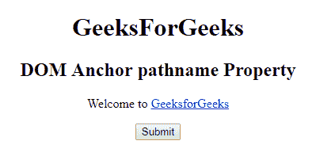
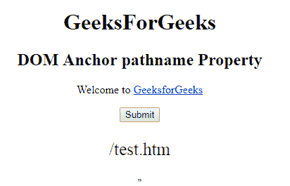
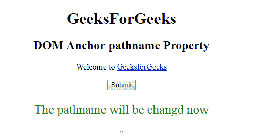

# HTML | DOM 锚点路径名属性

> 原文:[https://www . geesforgeks . org/html-DOM-anchor-pathname-property/](https://www.geeksforgeeks.org/html-dom-anchor-pathname-property/)

HTML DOM 中的 **DOM 锚点路径名属性**用于**设置**或**返回***href 属性值的路径名部分*。所有浏览器将返回“/test.htm”，而 IE 9 将返回“test.htm”。

**语法:**

*   它返回路径名属性。

    ```html
    anchorObject.pathname
    ```

*   它用于设置 pathname 属性。

    ```html
    anchorObject.pathname = path
    ```

**属性值:**包含指定网址路径名的值，即**路径**。

**返回值:**返回一个代表网址路径名的字符串值。

**示例-1:** 本示例返回 URL 的路径名。

```html
<!DOCTYPE html>
<html>

<head>
    <title>
        HTML DOM Anchor pathname Property
    </title>
</head>

<body>
    <center>
        <h1>
          GeeksForGeeks
      </h1>

        <h2>
          DOM Anchor pathname Property
      </h2>

        <p>Welcome to
            <a href=
     "http://www.example.com:80/test.htm#part2" 
               id="GFG"
               rel="nofollow"
               target="_self"> 
                GeeksforGeeks 
            </a>
        </p>

        <button onclick="myGeeks()">
          Submit
      </button>

        <p id="sudo" 
           style="color:green;
                  font-size:25px;">
      </p>

        <script>
            function myGeeks() {

                var x = 
                    document.getElementById(
                      "GFG").pathname;

                document.getElementById(
                  "sudo").innerHTML = x;
            }
        </script> "
    </center>
</body>

</html>
```

**输出:**
**点击按钮前:**


**点击按钮后:**


**示例-2 :** 本示例设置 URL 的路径名。

```html
<!DOCTYPE html>
<html>

<head>
    <title>
        HTML DOM Anchor pathname Property
    </title>
</head>

<body>
    <center>
        <h1>
          GeeksForGeeks
      </h1>

        <h2>
          DOM Anchor pathname Property
      </h2>

        <p>Welcome to
            <a href=
       "http://www.example.com:80/test.htm#part2" 
               id="GFG"
               rel="nofollow" 
               target="_self"> 
                GeeksforGeeks 
            </a>
        </p>

        <button onclick="myGeeks()">
          Submit
      </button>

        <p id="sudo" 
           style="color:green;
                  font-size:25px;">
      </p>

        <script>
            function myGeeks() {

                var x = 
                    document.getElementById(
                      "GFG").pathname;

                document.getElementById(
                  "sudo").innerHTML = 
                  "The pathname will be changd now";
            }
        </script> "
    </center>
</body>

</html>
```

**输出:**

**点击按钮前:**


**点击按钮后:**


**支持的浏览器:****DOM 锚点路径名属性**支持的浏览器如下:

*   谷歌 Chrome
*   Internet Explorer 10.0 +
*   火狐浏览器
*   歌剧
*   旅行队