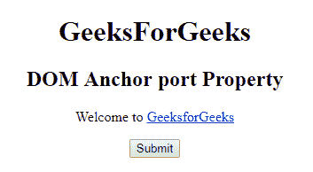
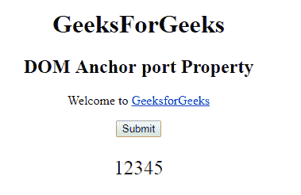
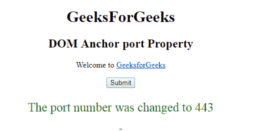

# HTML | DOM 锚点端口属性

> 原文:[https://www . geesforgeks . org/html-DOM-anchor-port-property/](https://www.geeksforgeeks.org/html-dom-anchor-port-property/)

HTML DOM 中的 **DOM 锚点端口属性**用于**设置**或**返回***href 属性值*的端口部分。它的默认值为 80 或 443。如果 URL 中没有指定端口号，某些浏览器将返回 0 或未定义。

**语法:**

*   它返回端口属性。

    ```html
    anchorObject.port
    ```

*   它用于设置端口属性。

    ```html
    anchorObject.port = number
    ```

**属性值:**它包含定义网址端口号的值，即数字。

**返回值:**返回一个代表网址端口号的字符串值。

**示例-1:** 本示例返回 URL 的端口号。

```html
<!DOCTYPE html>
<html>

<head>
    <title>
        HTML DOM Anchor port Property
    </title>
</head>

<body>
    <center>
        <h1>
          GeeksForGeeks
      </h1>

        <h2>
          DOM Anchor port Property
      </h2>

        <p>
          Welcome to <a href=
          "http://example.com:12345/gfg');" 
                        id="GFG" 
                        rel="nofollow"
                        target="_self"> 
                GeeksforGeeks 
            </a>
        </p>

        <button onclick="myGeeks()">
          Submit
      </button>

        <p id="sudo" 
           style="color:green;
                  font-size:25px;">
      </p>

        <script>
            function myGeeks() {

                var x = 
                    document.getElementById(
                      "GFG").port;

                document.getElementById(
                  "sudo").innerHTML = x;
            }
        </script> 
    </center>
</body>

</html>
```

**输出:**
**点击按钮前:**


**点击按钮后:**


**示例-2:** 本示例设置或更改 URL 的端口号。

```html
<!DOCTYPE html>
<html>

<head>
    <title>
        HTML DOM Anchor port Property
    </title>
</head>

<body>
    <center>
        <h1>
          GeeksForGeeks
      </h1>

        <h2>
          DOM Anchor port Property
      </h2>

        <p>Welcome to <a href=
                         "http://example.com:12345/gfg');"
                         id="GFG" 
                         rel="nofollow" 
                         target="_self"> 
                GeeksforGeeks 
            </a>
        </p>

        <button onclick="myGeeks()">
          Submit
      </button>

        <p id="sudo" 
           style="color:green;
                  font-size:25px;">
      </p>

        <script>
            function myGeeks() {

                var x =
                    document.getElementById(
                      "GFG").port = "443";

                document.getElementById(
                  "sudo").innerHTML = 
                  "The port number was changed to " + x;
            }
        </script> "
    </center>
</body>

</html>
```

**输出:**

**点击按钮前:**


**点击按钮后:**


**支持的浏览器:****DOM 锚点端口属性**支持的浏览器如下:

*   谷歌 Chrome
*   Internet Explorer 10.0 +
*   火狐浏览器
*   歌剧
*   旅行队