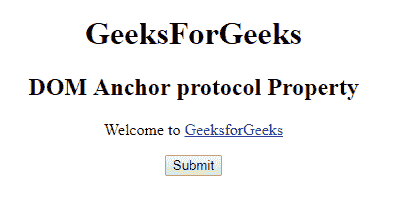
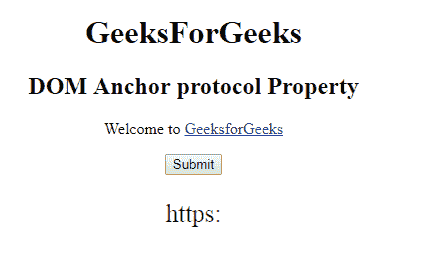
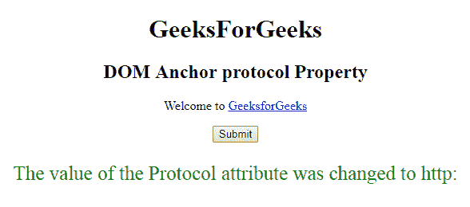

# HTML | DOM 锚点协议属性

> 原文:[https://www . geesforgeks . org/html-DOM-anchor-protocol-property/](https://www.geeksforgeeks.org/html-dom-anchor-protocol-property/)

HTML DOM 中的**锚点协议属性**用于设置或返回 href 属性值的协议部分的值。该协议用于指定数据如何在两台计算机之间传输。

**语法:**

*   它返回锚协议属性。

```html
anchorObject.protocol
```

*   它用于设置锚协议属性。

```html
anchorObject.protocol = protocol
```

**属性值:**它包含单个值**协议**，指定数据如何在两台计算机之间传输。例如:文件、ftp、http、https、mailto 等。
**返回值:**它返回一个字符串值，该值代表网址的协议部分，还包括冒号(:)。
**示例 1:** 本示例返回锚协议属性。

## 超文本标记语言

```html
<!DOCTYPE html>
<html>

<head>
    <title>
        HTML DOM Anchor protocol Property
    </title>
</head>

<body>
    <center>
        <h1>GeeksForGeeks</h1>

        <h2>DOM Anchor protocol Property</h2>

<p>Welcome to
            <a href =
"https://write.geeksforgeeks.org/wp-admin/post.php?post=964437&action=edit"
            id="GFG" rel="nofollow" target= "_self">
                GeeksforGeeks
            </a>
        </p>

        <button onclick = "myGeeks()">Submit</button>

        <p id = "sudo" style="color:green;font-size:25px;"></p>

        <!-- Script to return Anchor protocol Property -->
        <script>
            function myGeeks() {
                var x = document.getElementById("GFG").protocol;
                document.getElementById("sudo").innerHTML = x;
            }
        </script>
    </center>
</body>

</html>                   
```

**输出:**
**点击按钮前:**



**点击按钮后:**



**示例 2:** 本示例设置锚协议属性。

## 超文本标记语言

```html
<!DOCTYPE html>
<html>

<head>
    <title>
        HTML DOM Anchor protocol Property
    </title>
</head>

<body>
    <center>
        <h1>GeeksForGeeks</h1>

        <h2>DOM Anchor protocol Property</h2>

<p>Welcome to
            <a href =
"https://write.geeksforgeeks.org/wp-admin/post.php?post=964437&action=edit"
            id="GFG" rel="nofollow" target= "_self">
                GeeksforGeeks
            </a>
        </p>

        <button onclick = "myGeeks()">Submit</button>

        <p id = "sudo" style="color:green;font-size:25px;"></p>

        <!-- Script to set Anchor protocol Property -->
        <script>
            function myGeeks() {
                var x = document.getElementById("GFG").protocol
                        = "http";
                document.getElementById("sudo").innerHTML
                        = "The value of the Protocol attribute "
                        + "was changed to " + x;
            }
        </script>
    </center>
</body>

</html>                         
```

**输出:**
**点击按钮前:**


**点击按钮后:**



**支持的浏览器:****锚点协议属性**支持的浏览器如下:

*   谷歌 Chrome
*   微软公司出品的 web 浏览器
*   火狐浏览器
*   歌剧
*   旅行队