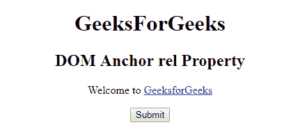
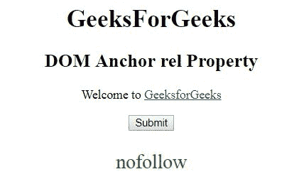
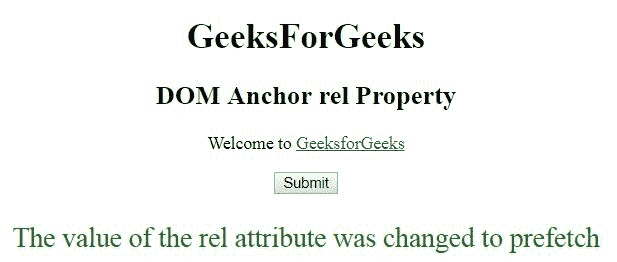

# HTML | DOM 锚点依赖属性

> 原文:[https://www.geeksforgeeks.org/html-dom-anchor-rel-property/](https://www.geeksforgeeks.org/html-dom-anchor-rel-property/)

HTML DOM 中的**锚点 rel 属性**用于设置或返回链接的 rel 属性值。 **rel 属性**用于指定当前文档和链接文档之间的关系。
**语法:**

*   它返回锚定 rel 属性。

```html
anchorObject.rel
```

*   它用于设置锚定相关属性。

```html
anchorObject.rel = "value"
```

**属性值:**

*   **替代版本:**它定义了文档的替代版本，即打印页面、翻译版本或镜像版本。
*   **作者:**定义文档的作者。
*   **书签:**指定相关文档。
*   **帮助:**指定帮助文档。
*   **许可:**定义文档的版权信息。
*   **下一步:**定义选择中的下一个文档。
*   **nofollow:** 它被谷歌使用，用来指定谷歌搜索蜘蛛不应该跟随那个链接，并且主要用于付费链接。
*   **noreferrer:** 用于指定如果用户跟随超链接，浏览器不应发送 HTTP referrer 头。
*   **预取:**指定缓存目标文档。
*   **prev:** 指定选择中的上一个文档。
*   **搜索:**指定文档的搜索工具。
*   **标签:**指定当前文档的标签关键字。

**返回值:**返回一个字符串值，代表当前文档和链接文档之间的关系。
**示例 1:** 本示例返回锚相关属性。

## 超文本标记语言

```html
<!DOCTYPE html>
<html>

<head>
    <title>
        HTML DOM Anchor rel Property
    </title>
</head>

<body>
    <center>
        <h1>GeeksForGeeks</h1>

        <h2>DOM Anchor rel Property</h2>

<p>Welcome to
            <a href =
"https://write.geeksforgeeks.org/wp-admin/post.php?post=964437&action=edit"
            id="GFG" rel="nofollow" target= "_self">
                GeeksforGeeks
            </a>
        </p>

        <button onclick = "myGeeks()">Submit</button>

        <p id = "sudo" style="color:green;font-size:25px;"></p>

        <!-- Script to return Anchor rel Property -->
        <script>
            function myGeeks() {
                var x = document.getElementById("GFG").rel;
                document.getElementById("sudo").innerHTML = x;
            }
        </script>
    </center>
</body>

</html>   
```

**输出:**
**点击按钮前:**



**点击按钮后:**



**示例 2:** 本示例设置锚点相关属性。

## 超文本标记语言

```html
<!DOCTYPE html>
<html>

<head>
    <title>
        HTML DOM Anchor rel Property
    </title>
</head>

<body>
    <center>
        <h1>GeeksForGeeks</h1>

        <h2>DOM Anchor rel Property</h2>

<p>Welcome to
            <a href =
"https://write.geeksforgeeks.org/wp-admin/post.php?post=964437&action=edit"
            id="GFG" rel="nofollow" target= "_self">
                GeeksforGeeks
            </a>
        </p>

        <button onclick = "myGeeks()">Submit</button>

        <p id = "sudo" style="color:green;font-size:25px;"></p>

        <!-- Script to set Anchor rel Property -->
        <script>
            function myGeeks() {
                var x = document.getElementById("GFG").rel
                        = "prefetch";

                document.getElementById("sudo").innerHTML
                        = "The value of the rel attribute "
                        + "was changed to " + x;
            }
        </script>
    </center>
</body>

</html>   
```

**输出:**
**点击按钮前:**


**点击按钮后:**



**支持的浏览器:**T2 DOM Anchor rel 属性支持的浏览器如下:

*   谷歌 Chrome
*   微软公司出品的 web 浏览器
*   火狐浏览器
*   歌剧
*   旅行队