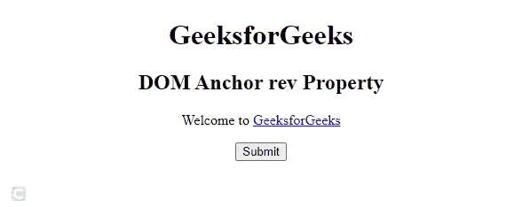
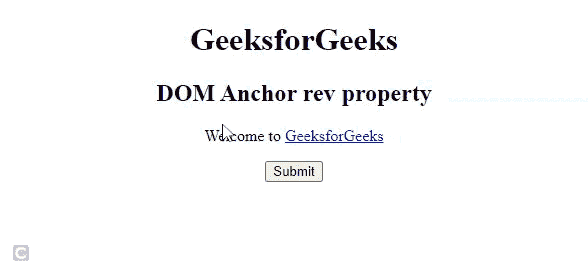

# HTML DOM 锚点 rev 属性

> 原文:[https://www.geeksforgeeks.org/html-dom-anchor-rev-property/](https://www.geeksforgeeks.org/html-dom-anchor-rev-property/)

**HTML DOM Anchor*****rev*****属性用于设置或返回 ***rev*** 属性中 [< a >](https://www.geeksforgeeks.org/html-a-tag/) 元素的值。 *rev* 属性用于指定链接文档和当前文档之间的关系。**

****语法:****

*   **它返回锚 *rev* 属性。**

    ```html
    anchorObject.rev
    ```

*   **用于设置锚 *rev* 属性。**

    ```html
    anchorObject.rev = "value"
    ```

****属性值:****

*   ****替代版本:**它定义了文档的替代版本，即打印页面、翻译或镜像。**
*   ****样式表:**它为文档定义一个外部表。**
*   **s**start:**它定义一个选择中的第一个文档。**
*   ****下一步:**定义选择中的下一个文档。**
*   ****prev:** 定义选择中的上一个文档。**
*   ****目录:**定义文档的目录。**
*   ****索引:**定义文档的索引。**
*   ****词汇表:**它定义了文档中使用的单词的解释。**
*   ****版权:**定义包含一条版权信息的文档。**
*   ****章节:**指定文档的章节。**
*   ****节:**定义文档的一个节。**
*   ****子节**:指定文件的一个子节。**
*   ****附录**:规定了文件的附录。**
*   ****帮助**:指定帮助文档。**
*   ****书签:**指定相关文档。**
*   ****nofollow:** 它被谷歌使用，用来指定谷歌搜索蜘蛛不应该跟随那个链接，并且主要用于付费链接。**
*   ****许可:**定义文档的版权信息。**
*   ****标签:**指定当前文档的标签关键字。**

****例 1:** 下面的代码说明了如何返回锚 *rev* 属性。**

## **超文本标记语言**

```html
<!DOCTYPE html>
<html>

<body>
    <center>
        <h1>GeeksforGeeks</h1>

        <h2>DOM Anchor rev Property</h2>

        <p>Welcome to
            <a href="https://www.geeksforgeeks.org" id="linkID"
                rev="nofollow" target="_self">
                GeeksforGeeks
            </a>
        </p>

        <button onclick="btnClick()">Submit</button>

        <p id="paraID" style="color:green;font-size:25px;"></p>

        <!-- Script to return Anchor rel property -->
        <script>
            function btnClick() {
                var x = document.getElementById("linkID").rev;
                document.getElementById("paraID").innerHTML = x;
            }
        </script>
    </center>
</body>

</html>
```

****输出:****

****

****示例 2:** 下面的 HTML 代码说明了如何设置锚点 *rev* 属性。**

## **超文本标记语言**

```html
<!DOCTYPE html>
<html>

<head>
    <title>
        HTML DOM Anchor rev Property
    </title>
</head>

<body>
    <center>
        <h1>GeeksforGeeks</h1>

        <h2>DOM Anchor rev property</h2>

        <p>Welcome to
            <a href="https://www.geeksforgeeks.org" id="linkID"
                rev="nofollow" target="_self">
                GeeksforGeeks
            </a>
        </p>

        <button onclick="btnclick()">Submit</button>

        <p id="paraID" style="color:green;font-size:20px;"></p>

        <!-- Script to set Anchor rel property -->
        <script>
            function btnclick() {
                var x = document.getElementById(
                    "linkID").rel = "chapter";

                document.getElementById("paraID")
                    .innerHTML = "The value of the rev "
                    + "attribute was changed to " + x;
            }
        </script>
    </center>
</body>

</html>
```

****输出:****

****

****支持的浏览器:****

*   **谷歌 Chrome**
*   **微软公司出品的 web 浏览器**
*   **歌剧**
*   **火狐浏览器**
*   **苹果 Safari**