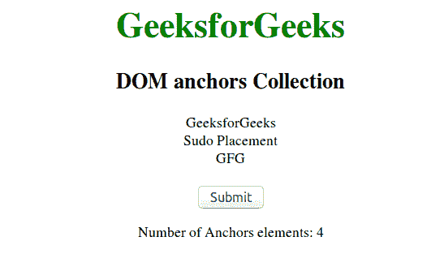
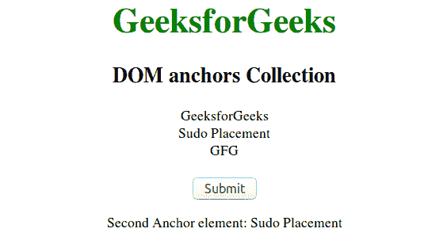

# HTML | DOM 锚点集合

> 原文:[https://www.geeksforgeeks.org/html-dom-anchors-collection/](https://www.geeksforgeeks.org/html-dom-anchors-collection/)

**DOM 锚定集合**用于返回一个 HTML 文档中所有<一个>元素的集合。它只计算那些只有名称属性的< a >元素。HTML 5 中不支持锚点元素的名称属性。集合中的元素按照源代码中显示的内容进行排序。
**语法:**

```html
document.anchors
```

**属性:**锚点集合属性包含一个值长度，该值长度返回文档中< a >元素的数量。
**方法:**DOM anchors 集合包含以下三种方法:

*   **【索引】:**用于返回所选索引的< a >元素。索引值以 0 开始。如果索引值超出范围，则返回空值。
*   **项(索引):**用于返回所选索引的< a >元素。索引值以 0 开始。如果索引值超出范围，则返回空值。
*   **name item(id):**用于从集合中返回给定 id 属性的< a >元素。如果 id 无效，它将返回 NULL。

**返回值:**一个 HTMLCollection 对象，表示文档中所有<一个>具有名称属性的元素。集合中的元素在源代码中出现时进行排序

**例 1:**

## 超文本标记语言

```html
<!DOCTYPE html>
<html>
    <head>
        <title>DOM anchors collection</title>
        <style>
            .gfg {
                font-size:40px;
                font-weight:bold;
                color:green;
            }
            body {
                text-align:center;
                font-family:Times;
            }
        </style>
    </head>
    <body>
        <a name="" class="gfg">GeeksforGeeks</a>
        <h2>DOM anchors Collection</h2>
        <a name="">GeeksforGeeks</a><br>
        <a name="">Sudo Placement</a><br>
        <a name="">GFG</a><br><br>
        <button onclick="Geeks()">Submit</button>
        <p id="sudo"></p>

        <script>
            function Geeks() {
                var x = document.anchors.length;
                document.getElementById("sudo").innerHTML =
                "Number of Anchors elements: " + x;
            }
        </script>
    </body>
</html>                   
```

**输出:**



**例 2:**

## 超文本标记语言

```html
<!DOCTYPE html>
<html>
    <head>
        <title>DOM anchors collection</title>
        <style>
            .gfg {
                font-size:40px;
                font-weight:bold;
                color:green;
            }
            body {
                text-align:center;
                font-family:Times;
            }
        </style>
    </head>
    <body>
        <a name="" class="gfg">GeeksforGeeks</a>
        <h2>DOM anchors Collection</h2>
        <a name="">GeeksforGeeks</a><br>
        <a name="">Sudo Placement</a><br>
        <a name="">GFG</a><br><br>
        <button onclick="Geeks()">Submit</button>
        <p id="sudo"></p>

        <script>
            function Geeks() {
                var x = document.anchors[2].innerHTML;
                document.getElementById("sudo").innerHTML =
                "Second Anchor element: " + x;
            }
        </script>
    </body>
</html>                   
```

**输出:**



**支持的浏览器:**T2 DOM 锚点集合支持的浏览器如下:

*   谷歌 Chrome
*   微软公司出品的 web 浏览器
*   火狐浏览器
*   歌剧
*   旅行队