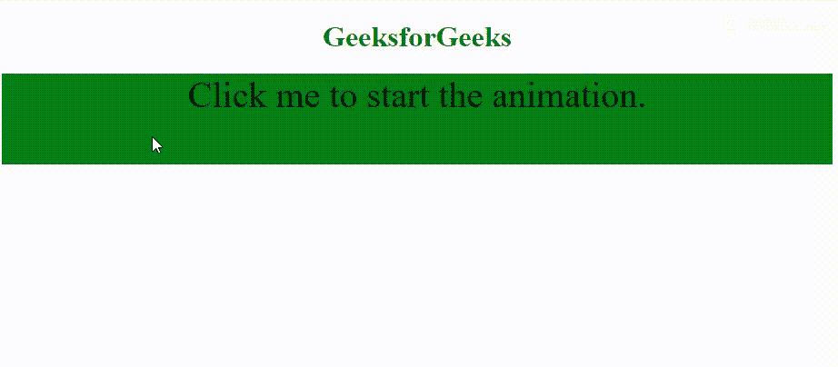

# HTML | DOM 动画事件

> 哎哎哎::1230【https://www . geeksforgeeks . org/html-DOM-animation d 事件/

**动画事件**发生在 [CSS 动画](https://www.geeksforgeeks.org/css-animations/)完成时。

**CSS 动画播放时发生的事件:**

*   **animationstart:** 当 CSS 动画已经开始播放时发生。
*   **动画迭代:**当 CSS 动画重复时发生。
*   **animationend:** 当 CSS 动画完成时发生。

**语法:**

*   **Chrome、Safari 和 Opera 的代码**

    ```html
    object.addEventListener("webkitAnimationEnd", myScript);
    ```

*   **标准语法:**

    ```html
    object.addEventListener("animationend", myScript);
    ```

**示例:**

```html
<!DOCTYPE html>
<html>

<head>
    <style>
        #div {
            width: 100%;
            height: 100px;
            background: green;
            position: relative;
            font-size: 40px;
        }

        /* Chrome, Safari, Opera */
        @-webkit-keyframes mymove {
            from {
                top: 0px;
            }
            to {
                top: 200px;
            }
        }

        @keyframes mymove {
            from {
                top: 0px;
            }
            to {
                top: 200px;
            }
        }
    </style>
</head>

<body>
    <center>
        <h1 style="color:green">GeeksforGeeks</h1>

        <div id="div" onclick="GFGFun()">
            Click me to start the animation.
        </div>

        <script>
            var x = document.getElementById("div");

            // Start the animation with JavaScript
            function GFGFun() {

                // Code for Chrome, Safari and Opera
                x.style.WebkitAnimation = "mymove 4s 1";

                // Standard syntax
                x.style.animation = "mymove 4s 1";
            }

            // Code for Chrome, Safari and Opera
            x.addEventListener("webkitAnimationStart", StartFun);
            x.addEventListener("webkitAnimationEnd", EndFun);

            // Standard syntax
            x.addEventListener("animationstart", StartFun);
            x.addEventListener("animationend", EndFun);

            function StartFun() {
                this.innerHTML = "The animation has started";
                this.style.backgroundColor = "lime";
            }

            function EndFun() {
                this.innerHTML = "The animation has completed";
                this.style.backgroundColor = "lightgray";
            }
        </script>
    </center>
</body>

</html>
```

**输出:**


**支持的浏览器:****动画和事件**支持的浏览器如下:

*   谷歌 Chrome 4.0 网络工具包
*   Internet Explorer 10.0
*   火狐 16.0， 5.0 moz
*   苹果 Safari 4.0 网络工具包
*   Opera 15.0 网络工具包，12.1