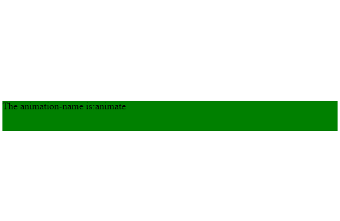
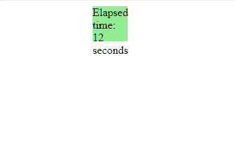

# HTML | DOM AnimationEvent

> 哎哎哎:# t0]https://www . geeksforgeeks . org/html-DOM-animation event/

在 HTML 文档中， **AnimationEvent** 接口用于表示提供动画相关信息的事件。**动画事件**包含*动画名称*、*动画时间*和*伪元素*等属性。

1.  **animationName:** The **animationName** property returns the name of the event animation. It returns the value of the **animation-name** CSS property associated with the transition.
    **Syntax:**

    ```html
    event.animationName;

    ```

    **返回类型:**返回一个代表动画名称的字符串。

    **示例-1:**

    ```html
    <!DOCTYPE html>
    <html>

    <head>
        <style>
            div {
                width: 550px;
                height: 50px;
                background: green;
                position: relative;
                -webkit-animation-name: animate;
                /* Chrome, Safari, Opera */
                -webkit-animation-duration: 5s;
                /* Chrome, Safari, Opera */
                animation-name: animate;
                animation-duration: 5s;
            }
            /* Chrome, Safari, Opera */

            @-webkit-keyframes animate {
                from {
                    top: 0px;
                }
                to {
                    top: 500px;
                }
            }

            @keyframes animate {
                from {
                    top: 0px;
                }
                to {
                    top: 500px;
                }
            }
        </style>
    </head>

    <body>
        <div id="div1"></div>
        <script>
            var x = document.getElementById("div1");

            // Code for Chrome, Safari and Opera
            x.addEventListener(
              "webkitAnimationStart", StartAnimation);

            // Standard syntax
            x.addEventListener(
              "animationstart", StartAnimation);

            // Return animation name
            function StartAnimation(event) {
                this.innerHTML =
                  "The animation-name is:"
                + event.animationName;
            }
        </script>
    </body>

    </html>
    ```

    **输出:**
    

2.  **elapsedTime:** The **elapsedTime** property returns the number of seconds for which an animation has been running in an animation event.

    **语法:**

    ```html
    event.elapsedTime;

    ```

    **返回类型:**返回一个数字，代表动画运行的秒数。

    **示例-2:**

    ```html
    <!DOCTYPE html>
    <html>

    <head>
        <style>
            div {
                width: 50px;
                height: 50px;
                background: green;
                position: relative;
                /* Chrome, Safari, Opera */
               -webkit-animation: animate 4s infinite;
                animation: animate 4s infinite;
            }
            /* Chrome, Safari, Opera */

            @-webkit-keyframes animate {
                from {
                    left: 500px;
                }
                to {
                    left: 0px;
                }
            }

            @keyframes animate {
                from {
                    left: 500px;
                }
                to {
                    left: 0px;
                }
            }
        </style>
    </head>

    <body>
        <div id="div1"></div>

        <script>
            var x = document.getElementById("div1");

            // Code for Chrome, Safari and Opera
            x.addEventListener(
           "webkitAnimationIteration", RepeatAnimation);

            // Standard syntax
            x.addEventListener(
            "animationiteration", RepeatAnimation);

            function RepeatAnimation(event) {

                this.style.backgroundColor = 
                  "lightgreen";
                this.innerHTML = "Elapsed time: "
                + event.elapsedTime + " seconds";
            }
        </script>
    </body>

    </html>
    ```

    **输出:**
    

**支持的浏览器:**

*   谷歌 Chrome
*   Mozilla Firefox
*   边缘
*   旅行队
*   歌剧