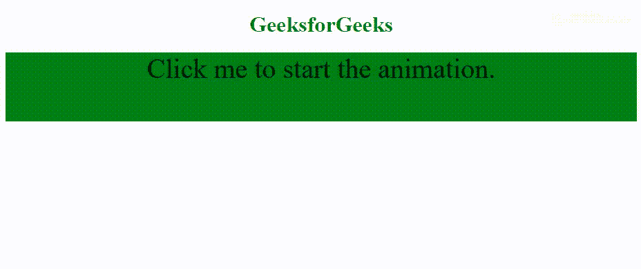

# HTML | DOM 动画事件

> 原文:[https://www . geesforgeks . org/html-DOM-animation iteration-event/](https://www.geeksforgeeks.org/html-dom-animationiteration-event/)

当一个 CSS 动画被重复时**动画化**事件发生。

如果 CSS 动画-迭代-计数属性设置为**“1”**，动画将只播放一次。动画需要运行多次才能触发此事件。

播放 CSS 动画时可能发生的事件:

*   **动画开始:**发生在 CSS 动画已经开始的时候。
*   **动画迭代:**在 CSS 动画重复时发生。
*   **动画化结束:**在 CSS 动画完成时发生。

**语法:**

*   **Chrome、Safari 和 Opera 的代码**

    ```html
    object.addEventListener("webkitAnimationIteration", myScript);
    ```

*   **标准语法:**

    ```html
    object.addEventListener("animationiteration", myScript);
    ```

**示例:**

```html
<!DOCTYPE html>
<html>

<head>
    <style>
        #div {
            width: 100%;
            height: 100px;
            background: green;
            position: relative;
            font-size: 40px;
        }

        /* Chrome, Safari, Opera */
        @-webkit-keyframes mymove {
            from {
                top: 0px;
            }
            to {
                top: 200px;
            }
        }

        @keyframes mymove {
            from {
                top: 0px;
            }
            to {
                top: 200px;
            }
        }
    </style>
</head>

<body>
    <center>
        <h1 style="color:green">
          GeeksforGeeks
      </h1>

        <div id="div" onclick="GFGFun()">
            Click me to start the animation.
        </div>

        <script>
            var x = document.getElementById("div");

            // Start the animation with JavaScript
            function GFGFun() {
                // Code for Chrome, Safari and Opera
                x.style.WebkitAnimation = "mymove 4s 2";
                // Standard syntax
                x.style.animation = "mymove 4s 2";
            }

            // Code for Chrome, Safari and Opera
            x.addEventListener("webkitAnimationStart", StartFun);
            x.addEventListener("webkitAnimationIteration", RepeatFun);

            // Standard syntax
            x.addEventListener("animationstart", StartFun);
            x.addEventListener("animationiteration", RepeatFun);

            function StartFun() {
                this.innerHTML = "The animation has started";
                this.style.backgroundColor = "lime";
            }

            function RepeatFun() {
                this.innerHTML = "Animation was played again";
                this.style.backgroundColor = "darkgreen";
            }
        </script>
    </center>
</body>

</html>
```

**输出:**


**支持的浏览器:**T2 DOM 动画事件支持的浏览器如下:

*   谷歌 Chrome
*   微软公司出品的 web 浏览器
*   火狐浏览器
*   苹果 Safari
*   歌剧