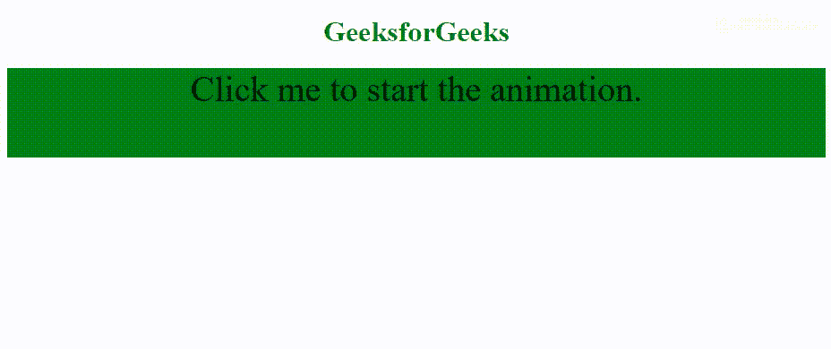

# HTML | DOM 动画启动事件

> 原文:[https://www . geesforgeks . org/html-DOM-animationstart-event/](https://www.geeksforgeeks.org/html-dom-animationstart-event/)

当 CSS 动画开始播放时， **animationstart** 事件发生。

**CSS 动画播放时可能发生的事件:**

*   **动画开始:**发生在 CSS 动画已经开始的时候。
*   **动画迭代:**在 CSS 动画重复时发生。
*   **动画化结束:**在 CSS 动画完成时发生。

**语法:**

*   **Chrome、Safari 和 Opera 的代码:**

    ```html
    object.addEventListener("webkitAnimationStart", myScript);
    ```

*   **标准语法:**

    ```html
    object.addEventListener("animationstart", myScript);
    ```

**示例:**

```html
<!DOCTYPE html>
<html>

<head>
    <style>
        #div {
            width: 100%;
            height: 100px;
            background: green;
            position: relative;
            font-size: 40px;
        }

        /* Chrome, Safari, Opera */
        @-webkit-keyframes mymove {
            from {
                top: 0px;
            }
            to {
                top: 200px;
            }
        }

        @keyframes mymove {
            from {
                top: 0px;
            }
            to {
                top: 200px;
            }
        }
    </style>
</head>

<body>
    <center>
        <h1 style="color:green">
          GeeksforGeeks
      </h1>

        <div id="div" 
             onclick="GFGFun()">
          Click me to start the animation.
      </div>

        <script>
            var x = document.getElementById("div");

            // Start the animation with JavaScript
            function GFGFun() {
                // Code for Chrome, Safari and Opera
                x.style.WebkitAnimation = "mymove 4s 1"; 

                // Standard syntax
                x.style.animation = "mymove 4s 1"; 
            }

            // Code for Chrome, Safari and Opera
            x.addEventListener("webkitAnimationStart", StartFun);

            // Standard syntax
            x.addEventListener("animationstart", StartFun);

            function StartFun() {
                this.innerHTML = "The animation has started";
                this.style.backgroundColor = "lime";
            }
        </script>
    </center>
</body>

</html>
```

**输出:**


**支持的浏览器:****动画开始事件**支持的浏览器如下:

*   谷歌 Chrome
*   微软公司出品的 web 浏览器
*   火狐浏览器
*   苹果 Safari
*   歌剧