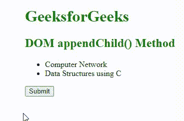
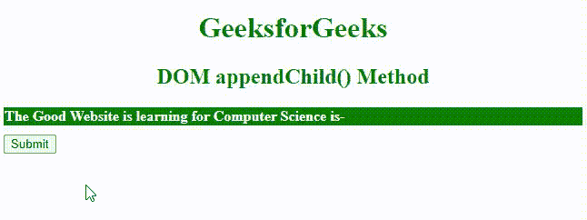

# HTML DOM appendChild()方法

> 原文:[https://www.geeksforgeeks.org/html-dom-appendchild-method/](https://www.geeksforgeeks.org/html-dom-appendchild-method/)

在本文中，我们将学习 Javascript 中 [HTML DOM](https://www.geeksforgeeks.org/html-dom-html-object/) 中的 appendChild()方法，并通过示例了解其实现。

[节点](https://www.geeksforgeeks.org/introduction-to-node-js/)界面的 **appendChild()** 方法，用于创建一个文本节点作为该节点的最后一个子节点。此方法也用于将一个元素从一个元素移动到另一个元素。它用于创建包含一些文本的新元素，然后首先创建文本作为文本节点，然后将其附加到元素中，然后将元素附加到文档中。

**语法:**

```html
node.appendChild(node);
```

**参数:**该方法接受单个参数*节点*，该参数为必选项，用于指定需要追加的节点对象。

我们将使用 [**document.createElement()方法**](https://www.geeksforgeeks.org/html-dom-createelement-method/) 来创建 HTML 元素 ie。，将创建用 elementName 指定的元素，或者如果无法识别指定的 elementName，将创建未知的 HTML 元素。我们还将使用 [**createTextNode()方法**](https://www.geeksforgeeks.org/html-dom-createtextnode-method/) 来创建包含元素节点和文本节点的 TextNode。此方法用于向元素提供文本，该元素将包含文本值作为参数&，它是字符串类型。 [**getElementById()方法**](https://www.geeksforgeeks.org/html-dom-getelementbyid-method/) 将返回包含给定 Id 的元素，这些元素将被传递给函数。

**示例 1:** 本示例描述了 **appendChild()** 方法的使用，该方法将创建文本节点作为节点的最后一个子节点。

## 超文本标记语言

```html
<!DOCTYPE html>
<html>

<head>
    <title>DOM appendChild() Method</title>
    <style>
    h1,
    h2 {
        font-weight: bold;
        color: green;
    }

    body {
        margin-left: 130px;
    }
    </style>
</head>

<body>
    <h1>GeeksforGeeks</h1>
    <h2>DOM appendChild() Method</h2>
    <ul id="gfg">
        <li>Computer Network</li>
        <li>Data Structures using C</li>
    </ul>
    <button onclick="geeks()">Submit</button>

    <script>
    function geeks() {
        var node = document.createElement("LI");
        var textnode = document.createTextNode("Web Technology");
        node.appendChild(textnode);
        document.getElementById("gfg").appendChild(node);
    }
    </script>
</body>

</html>
```

**输出:**



DOM appendChild()方法

**示例 2:** 本示例描述了 **appendChild()** 方法的使用，在单击提交按钮后将文本追加到文档中。

## 超文本标记语言

```html
<!DOCTYPE html>
<html>

<head>
    <title>DOM appendChild() Method</title>
    <style>
    #sudo {
        border: 1px solid green;
        background-color: green;
        margin-bottom: 10px;
        color: white;
        font-weight: bold;
    }

    h1,
    h2 {
        text-align: center;
        color: green;
        font-weight: bold;
    }
    </style>
</head>

<body>
    <h1>GeeksforGeeks</h1>
    <h2>DOM appendChild() Method</h2>
    <div id="sudo">
         The Good Website is learning for Computer Science is-
    </div>
    <button onclick="geeks()">Submit</button>
    <script>
    function geeks() {
        var node = document.createElement("P");
        var t = document.createTextNode("GeeksforGeeks");
        node.appendChild(t);
        document.getElementById("sudo").appendChild(node);
    }
    </script>
</body>

</html>
```

**输出:**



DOM appendChild()方法

**支持的浏览器:**以下是 *DOM appendChild()* 方法支持的浏览器:

*   谷歌 Chrome 1.0
*   Internet Explorer 5.0
*   微软边缘 12.0
*   Firefox 1.0
*   Opera 5.0
*   Safari 1.1