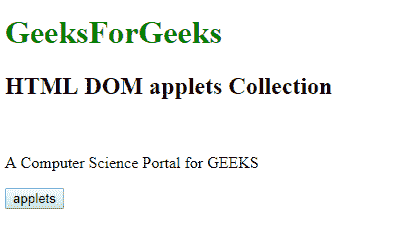
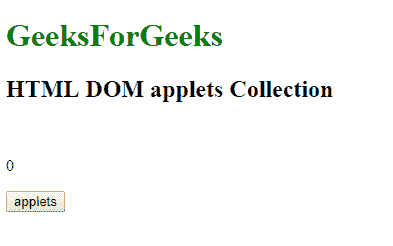

# HTML | DOM 小程序集合

> 原文:[https://www.geeksforgeeks.org/html-dom-applets-collection/](https://www.geeksforgeeks.org/html-dom-applets-collection/)

**小程序集合**将会**返回**一个在 HTML 文档对象模型中可用的所有可能元素的*集合。最初，该元素用于将 Java 应用程序嵌入到 HTML DOM 中。在 Javascript 插件引入后不久，applet 元素就被弃用了。*

**语法:**

```html
document.applets
```

**属性值:**

*   **length:** The length property value would return the total number of elements present in the specified collection.

    **注意:**该属性为绝对只读属性。

    **方法:**

    *   **索引:**[index]方法将从集合中返回具有从 0 开始的已定义索引的元素。
        **注意:**如果索引号超出规定范围，将返回 null。
    *   **item(index):**item(index)方法将从集合中返回具有从 0 开始的已定义索引的元素。
        **注意:**如果索引号超出规定范围，将返回 null。
    *   **NameItem(id):**NameItem(id)方法将返回集合中具有上述 id 的元素。
        **注意:**如果找到的 id 似乎不存在，则返回 null。

    **返回值:**小程序集合的返回值将是一个 HTML 集合对象，具有文档对象模型中所有元素的特征。集合中的元素按照它们在源代码中出现的方式排列。
    **注意:**小程序集合元素与 HTML5 的最新版本不兼容。

    **示例:**

    ```html
    <!DOCTYPE html>
    <html>

    <head>
        <title>
          HTML DOM applets Collection 
      </title>
    </head>

    <body>

        <h1 style="color:green;width:100%"> 
                    GeeksForGeeks 
                </h1>

        <h2>
          HTML DOM applets Collection
      </h2>
        <br>
        <p id="Geeks">
            A Computer Science Portal for GEEKS

        </p>
        <button type="button" 
                onclick="geeks()">
            applets
        </button>

        <script>
            function geeks() {
                var g = document.applets.length;

                document.getElementById(
                  "Geeks").innerHTML = g.toString();
            }
        </script>
    </body>

    </html>
    ```

    **输出:**
    **前:**
    
    **后:**
    

    **支持的浏览器:**

    *   谷歌 Chrome 1.0
    *   Internet Explorer 4.0
    *   Firefox 1.0
    *   歌剧 3.5
    *   Safari 1.0