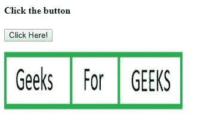
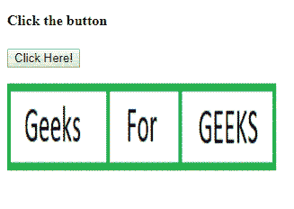

# HTML | DOM 区域对象

> 原文:[https://www.geeksforgeeks.org/html-dom-area-object/](https://www.geeksforgeeks.org/html-dom-area-object/)

HTML DOM 中的**区域对象**属性用于创建和访问对象中的 **<区域>** 元素。例如，使图像区域可点击，并通过可在地图或其他对象中进一步使用的区域访问其他数据。

**语法:**

*   它用于访问元素。

    ```html
    var x = document.getElementById("myArea");
    ```

*   用于创建元素。

    ```html
    var x = document.createElement("AREA");
    ```

**属性值:**

| 价值 | 描述 |
| 中高音 | 它用于设置或返回区域的 alt 属性值。 |
| 坐标 | 它用于设置或返回一个区域的坐标属性值。 |
| 混杂 | 它用于设置或返回 href 属性值的锚点部分。 |
| 宿主 | 它用于设置或返回 href 属性值的主机名和端口部分。 |
| 主机名 | 它用于设置或返回 href 属性值的主机名部分。 |
| href | 它用于设置或返回区域的 href 属性值。 |
| noHref | 它用于设置或返回区域的 nohref 属性的值。 |
| 起源 | 它用于返回 href 属性值的协议、主机名和端口部分。 |
| 密码 | 它用于设置或返回 href 属性值的密码部分。 |
| 路径名 | 它用于设置或返回 href 属性值的路径名部分。 |
| 港口 | 它用于设置或返回 href 属性值的端口部分。 |
| 草案 | 它用于设置或返回 href 属性值的协议部分。 |
| 搜索 | 它用于设置或返回 href 属性值的 querystring 部分。 |
| 形状 | 它用于设置或返回区域的形状属性值。 |
| 目标 | 它用于设置或返回一个区域的目标属性值。 |
| 用户名 | 它用于设置或返回 href 属性值的用户名部分。 |

**示例-1:** 返回可点击图像的 href 属性。

```html
<!DOCTYPE html>
<html>
<title>
    HTML DOM Area Object Property
</title>

<body>
    <h4>Click the button</h4>
    <button onclick="GFG()">Click Here!
        <br>
    </button>
    <map name="Geeks1">
        <area id="Geeks"
              shape="rect"
              coords="0, 0, 110, 100"
              alt="Geeks"
              href=
"https://media.geeksforgeeks.org/wp-content/uploads/a1-21.png">
    </map>

    

    <p id="GEEK!"></p>

    <script>
        function GFG() {

            //  Return href attribute.
            var x = 
            document.getElementById("Geeks").href;

            document.getElementById(
            "GEEK!").innerHTML = x;
        }
    </script>
</body>

</html>
```

**输出:**


**示例-2:** 创建区域元素并设置 href 属性。

```html
<!DOCTYPE html>
<html>
<title>
    HTML DOM Area Object Property
</title>

<body>
    <h4>Click the button</h4>
    <button onclick="GFG()">Click Here!
        <br>
    </button>
    <p></p>
    

    <map id="myMap" name="planetmap">
    </map>

    <p id="GEEK!"></p>

    <script>
        function GFG() {

            // creating area element using 
            // document.createElement("AREA");
            var y = document.createElement("AREA");
            y.setAttribute("href",
"https://media.geeksforgeeks.org/wp-content/uploads/a1-24.png");
            y.setAttribute("shape", "rect");
            y.setAttribute("coords", "190, 0, 300, 100");
            document.getElementById("myMap").appendChild(y);

            document.getElementById("GEEK!").innerHTML =
                "Click on the GEEKS area in the image.";
        }
    </script>
</body>

</html>
```

**输出:**


**执行上述代码的步骤:**

*   保存文件
*   在标准浏览器上执行。

**支持的浏览器:****DOM 区域对象属性**支持的浏览器如下:

*   谷歌 Chrome 5.0
*   Internet Explorer 8.0
*   Firefox 3.6
*   Safari 5.0
*   歌剧 10.6