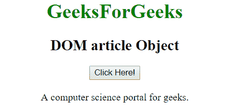

# HTML | DOM 文章对象

> 原文:[https://www.geeksforgeeks.org/html-dom-article-object/](https://www.geeksforgeeks.org/html-dom-article-object/)

**DOM 文章对象**用于表示 HTML <文章>元素。可以使用 **getElementById()** 方法访问文章元素。

**语法:**

```html
document.getElementById("id"); 
```

其中‘id’是分配给**物品**标签的 ID。

**示例-1:** 在下面的程序中，点击按钮即可访问文章对象，元素内文本的颜色也随之改变。

## 超文本标记语言

```html
<!DOCTYPE html>
<html>
<body>
    <center>
        <h1 style = "color:green;" >
          GeeksForGeeks
        </h1>

        <h2>DOM article Object</h2>

        <button onclick="Geeks()">Click Here</button>
        <br><br>

        <article id="s">A computer science portal for geeks.</article>

        <script>
            function Geeks() {
                var txt = document.getElementById("s");
                txt.style.color = "green";
            }
        </script>
</body>
</html>
```

**输出:**
**点击按钮前:**


**点击按钮后:**


**示例-2:** 可以使用 **document.createElement** 方法创建文章对象。

## 超文本标记语言

```html
<!DOCTYPE html>
<html>
<body>
<center>
        <h1 style = "color:green;" >
          GeeksForGeeks
        </h1>

        <h2>DOM article Object</h2>

        <button onclick="Geeks()">Click Here!</button><br><br>

        <div><span id = "p"></span></div>

        <script>
        function Geeks() {
            var txt = document.createElement("ARTICLE");
            var t = document.createTextNode("A computer
                              science portal for geeks.");

            txt.appendChild(t);

            document.getElementById("p").appendChild(txt);
        }
        </script>
</body>
</html>
```

**输出:**
**点击按钮前:**


**点击按钮后:**



**支持的浏览器**s:**HTML DOM 文章对象**支持的浏览器如下:

*   谷歌 Chrome
*   internet Explorer(IE 8 之后)
*   火狐浏览器
*   歌剧
*   旅行队