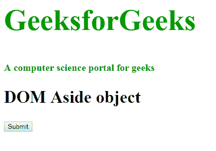
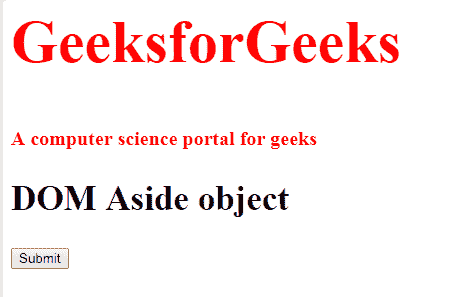
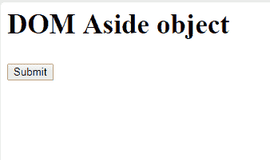
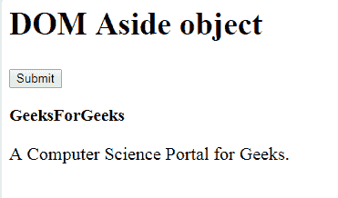

# HTML DOM 侧边对象

> 原文:[https://www.geeksforgeeks.org/html-dom-aside-object/](https://www.geeksforgeeks.org/html-dom-aside-object/)

**DOM 旁白对象**用于表示 HTML <旁白>元素。getElementById()可以访问 Aave 元素。一旁的元素在 html 5 中是新的。
**语法:**

```html
document.getElementById("ID");

```

其中“id”是分配给旁边标签的 ID。
**例-1:**

```html
<!DOCTYPE html>
<html>

<head>
    <title>aside tag</title>
    <style>
        .gfg {
            font-size: 30px;
        }

        aside {
            font-size: 40px;
            color: #090;
            font-weight: bold;
        }

        p {
            font-size: 20px;
            margin: 20px 0;
        }
    </style>
</head>

<body>
    //Assign ID to the aside tag.
    <aside id="GFG">
        <h1>GeeksforGeeks</h1>
        <p>A computer science portal for geeks</p>
    </aside>

    <h2 style="font-size:35px;">DOM Aside object</h2>
    <button onclick="myGeeks()">Submit</buttom>
        <script>
            function myGeeks() {
                var w = document.getElementById("GFG");
                w.style.color = "red";
            }
        </script>
</body>

</html>                
```

**输出:**
**点击按钮前:**

**点击按钮后:**

**示例-2:** 可以使用 **document.createElement** 方法创建侧边对象。

```html
<!DOCTYPE html>
<html>

<head>
    <title>aside tag</title>
    <style>
        .gfg {
            font-size: 30px;
        }

        p {
            font-size: 20px;
            margin: 20px 0;
        }
    </style>
</head>

<body>
    <center>
        <h2 style = "font-size:35px;">DOM Aside object</h2>
        <button onclick="myGeeks()">Submit</buttom>
            <script>
                function myGeeks() {
                    var w = document.createElement("ASIDE");
                    w.setAttribute("id", "GFG");
                    document.body.appendChild(w);

                    var heading = document.createElement("H3");
                    var text1 = 
                    document.createTextNode("GeeksForGeeks");

                    heading.appendChild(text1);
                    document.getElementById("GFG"
                    ).appendChild(heading);

                    var para = document.createElement("P");
                    var text2 = document.createTextNode(
                    "A Computer Science Portal for Geeks.");

                    para.appendChild(text2);
                    document.getElementById("GFG"
                    ).appendChild(para);
                }
            </script>
</body>

</html>  
```

**输出:**
**点击按钮前:**

**点击按钮后:**

**支持的浏览器:**支持的浏览器**DOM average Object**如下:

*   谷歌 Chrome
*   微软公司出品的 web 浏览器
*   火狐浏览器
*   歌剧
*   旅行队