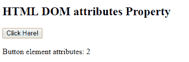

# HTML | DOM 属性属性

> 原文:[https://www.geeksforgeeks.org/html-dom-attributes-property/](https://www.geeksforgeeks.org/html-dom-attributes-property/)

HTML DOM 中的**属性属性**返回 NamedNodeMap 对象指定的节点属性组。NamedNodeMap 对象表示属性对象的集合，可以通过索引号进行访问。索引号从 0 开始。

**语法:**

```html
node.attributes
```

**返回值:**返回节点集合的 NamedNodeMap 对象。

**注意:**在 Internet Explorer 8 和更低版本中，attributes 属性将返回一个元素的所有可能属性的集合，这些属性可能会产生比预期值更高的值。

**例 1:**

```html
<!DOCTYPE html>
<html>
    <head>
        <title>
            HTML DOM attributes Property
        </title>
    </head>

    <body>

        <!-- Setting up an image -->
        

        <br>
        <button onclick = "myGeeks()">
            DOM attributes property
        </button>

        <p id = "demo"></p>

        <script>
            function myGeeks() {

            // It returns the number of nodes
            var x = document.getElementById("GFG").attributes.length; 

            // Display the number of nodes
            document.getElementById("demo").innerHTML = x; 
        }
        </script>
    </body>
</html>                    
```

**输出:**


**例 2:**

```html
<!DOCTYPE html>
<html>

<head>
    <title>
        HTML DOM attributes Property
    </title>
</head>

<body>
    <h2>
            HTML DOM attributes Property
        </h2>

    <button id="GFG" onclick="myGeeks()">
        Click Here!
    </button>

    <br>
    <br>

    <span>
            Button element attributes: 
        </span>

    <span id="sudo"></span>

    <script>
        function myGeeks() {

            // It returns the number of nodes    
            var gfg = 
                document.getElementById("GFG").attributes.length;

            // Display the number of nodes
            document.getElementById("sudo").innerHTML = gfg;
        }
    </script>
</body>

</html>
```

**输出:**


**支持的浏览器***DOM 属性属性*支持的浏览器如下:

*   谷歌 Chrome
*   微软公司出品的 web 浏览器
*   火狐浏览器
*   歌剧
*   苹果 Safari