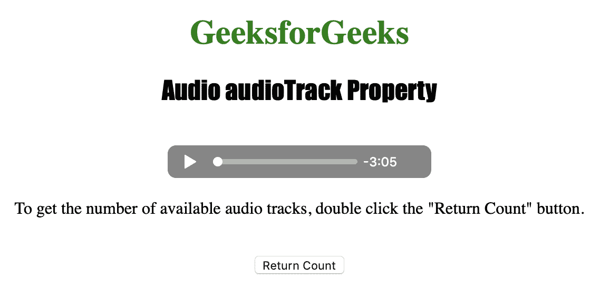
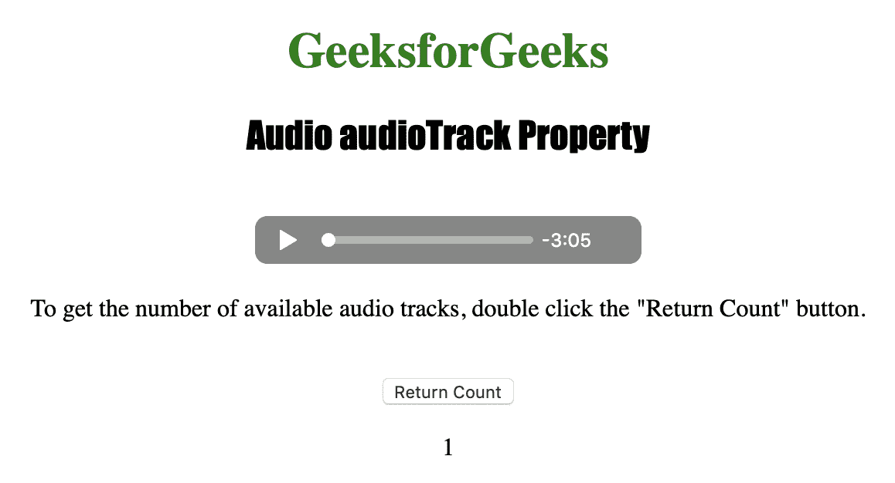

# HTML | DOM 音频音轨属性

> 原文:[https://www . geesforgeks . org/html-DOM-audio-audio tracks-property/](https://www.geeksforgeeks.org/html-dom-audio-audiotracks-property/)

**音频音轨属性**用于*返回音频音轨列表对象*。视频可用的音频轨道由音频轨道列表对象表示。
音频轨道对象用于表示可用的音频轨道。
**语法:**

```html
audioObject.audioTracks
```

**返回值:**

1.  **音频轨道列表对象:**用于表示音频的可用音频轨道。
2.  **音轨对象:**用于表示一个音轨。

下面的程序说明了音频音轨属性:
**示例:**获取可用音轨的数量。

## 超文本标记语言

```html
<!DOCTYPE html>
<html>

<head>
    <title>
       Audio audioTrack Property
    </title>
</head>

<body style="text-align: center">

    <h1 style="color: green">
      GeeksforGeeks
    </h1>
    <h2 style="font-family: Impact">
      Audio audioTrack Property
    </h2>
    <br>

    <audio id="Test_Audio" controls>
        <source src="sample1.ogg"
                type="audio/ogg">

        <source src="sample1.mp3"
                type="audio/mpeg">
    </audio>

<p>To get the number of available
      audio tracks, double click the "Return
      Count" button.</p>

    <br>

    <button ondblclick="My_Audio()">
      Return Count
    </button>

    <p id="test"></p>

    <script>
        function My_Audio() {
            var a = document.getElementById(
              "Test_Audio").audioTracks.length;

            document.getElementById("test").innerHTML = a;
        }
    </script>

</body>

</html>
```

**输出:**

*   点击按钮前:



*   点击按钮后:



**支持的浏览器:**以下是 *HTML | DOM 音频音轨属性*支持的浏览器:

*   谷歌 Chrome
*   微软公司出品的 web 浏览器
*   火狐浏览器
*   歌剧
*   旅行队