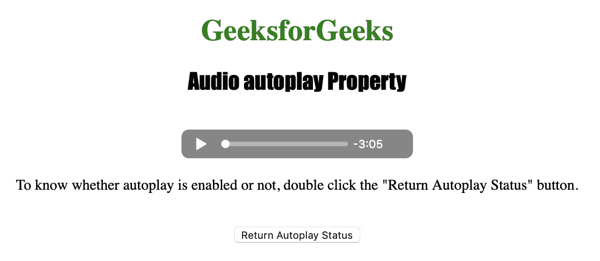
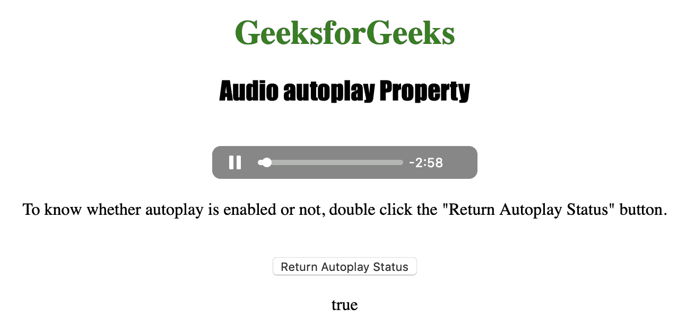

# HTML | DOM 音频自动播放属性

> 原文:[https://www . geesforgeks . org/html-DOM-audio-autoplay-property/](https://www.geeksforgeeks.org/html-dom-audio-autoplay-property/)

**音频自动播放属性**用于**设置**或**返回**是否*音频一加载就开始播放*。
可以用来指定音频一加载就自动开始播放。

**语法:**

*   返回自动播放属性:

    ```html
    audioObject.autoplay
    ```

*   设置自动播放属性:

    ```html
    audioObject.autoplay = true|false
    ```

**属性值:**

1.  **true|false:** 用于指定音频是否一加载就自动开始播放。

**返回值:**返回布尔值，如果音频自动开始播放，则返回 true，否则返回 false

下面的程序说明了音频自动播放属性:
**示例:**启用音频自动播放。

```html
<!DOCTYPE html>
<html>

<head>
    <title>
        Audio autoplay property
    </title>
</head>

<body style="text-align: center">

    <h1 style="color: green">
      GeeksforGeeks
    </h1>
    <h2 style="font-family: Impact">
      Audio autoplay Property
    </h2>
    <br>

    <audio id="Test_Audio"
           controls autoplay>
        <source src="sample1.ogg" type="audio/ogg">
        <source src="sample1.mp3" type="audio/mpeg">
    </audio>

    <p>To know whether autoplay is enabled or not,
      double click the "Return Autoplay Status" button.
    </p>
    <br>

    <button ondblclick="My_Audio()">
      Return Autoplay Status
    </button>

    <p id="test"></p>

    <script>
        function My_Audio() {
            var a = 
               document.getElementById("Test_Audio").autoplay;
               document.getElementById("test").innerHTML = a;
        }
    </script>

</body>

</html>
```

**输出:**

*   点击按钮前:
    
*   点击按钮后:
    

**支持的浏览器:**以下是 *HTML | DOM 音频自动播放属性*支持的浏览器:

*   谷歌 Chrome
*   微软公司出品的 web 浏览器
*   火狐浏览器
*   歌剧
*   苹果 Safari