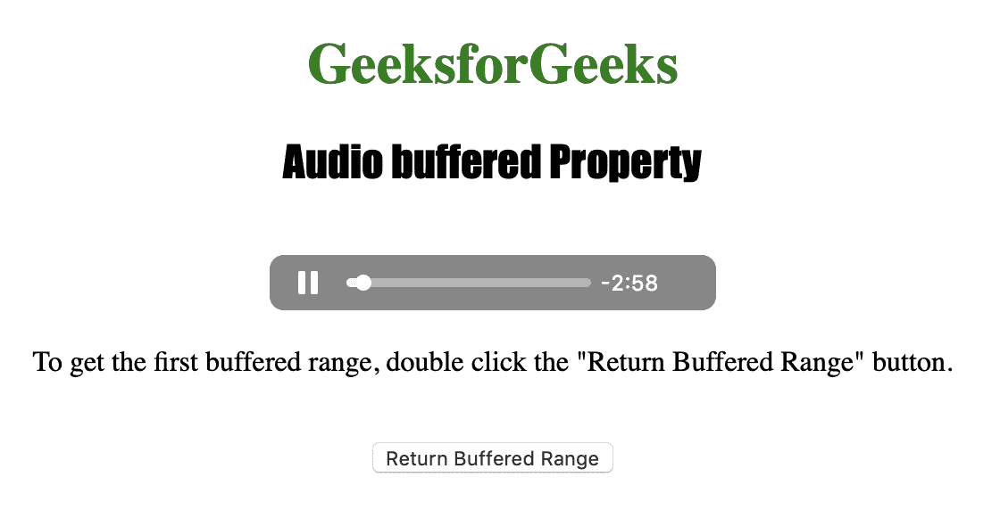
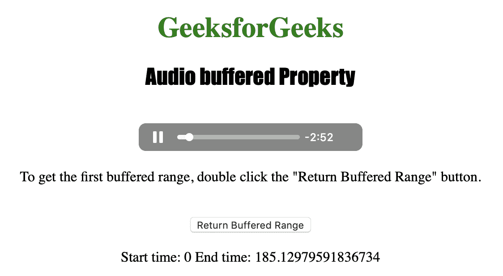

# HTML | DOM 音频缓冲属性

> 原文:[https://www . geesforgeks . org/html-DOM-audio-buffered-property/](https://www.geeksforgeeks.org/html-dom-audio-buffered-property/)

**音频缓冲属性**用于*返回时间范围对象*。用户缓冲的音频范围可以使用时间范围对象来表示。
缓冲音频的时间范围由缓冲范围定义，如果用户跳过音频，可能会产生多个缓冲范围。

**语法:**

```html
audioObject.buffered
```

**返回值:**

1.  **时间范围对象:**用于表示音频的缓冲部分。

下面的程序说明了音频缓冲属性:
**示例:**以秒为单位获取音频的第一个缓冲范围。

```html
<!DOCTYPE html>
<html>

<head>
    <title>
        Audio buffered Property
    </title>
</head>

<body style="text-align: center">

    <h1 style="color: green">
      GeeksforGeeks</h1>

    <h2 style="font-family: Impact">
      Audio buffered Property</h2>
    <br>

    <audio id="Test_Audio" controls autoplay>
        <source src="sample1.ogg" type="audio/ogg">
        <source src="sample1.mp3" type="audio/mpeg">
    </audio>

    <p>To get the first buffered range, 
      double click the "Return Buffered
      Range" button.</p>
    <br>

    <button ondblclick="My_Audio()">
      Return Buffered Range
    </button>

    <p id="test"></p>

    <script>
        function My_Audio() {
            var a = document.getElementById("Test_Audio");
            document.getElementById("test").innerHTML = 
              "Start time: " + a.buffered.start(0) + 
              " End time: " + a.buffered.end(0);
        }
    </script>

</body>

</html>
```

**输出:**

*   点击按钮后:
    
*   点击按钮后:
    

**支持的浏览器:**以下是 *HTML | DOM 音频缓冲属性*支持的浏览器:

*   谷歌 Chrome
*   微软公司出品的 web 浏览器
*   火狐浏览器
*   歌剧
*   苹果 Safari