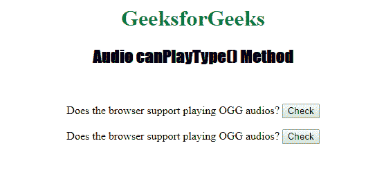
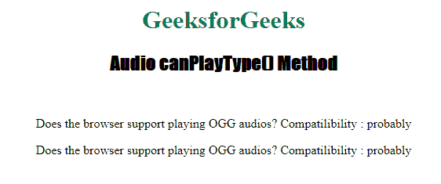

# HTML | DOM 音频 canPlayType()方法

> 原文:[https://www . geesforgeks . org/html-DOM-audio-canplaytype-method/](https://www.geeksforgeeks.org/html-dom-audio-canplaytype-method/)

**音频播放类型()方法**用于检查浏览器是否可以播放指定的音频类型。
**返回:**Audio canPlayType()方法通常返回以下值之一:

*   **“可能”:**表示浏览器最有可能支持这种音频类型。
*   **“可能”:**表示浏览器可能支持这种音频类型。
*   **" "(空字符串):**表示浏览器不支持这种音频类型。

**语法**

```html
audioObject.canPlayType(type)
```

**例:**

## 超文本标记语言

```html
<!DOCTYPE html>
<html>

<head>
    <title>
        DOM Audio canPlayType( ) Method
    </title>
</head>

<body style="text-align: center">

    <h1 style="color: green">
    GeeksforGeeks
</h1>
    <h2 style="font-family: Impact">
    Audio canPlayType() Method
</h2>
    <br>

<p>
        Does the browser support playing OGG audios? <span>
<button ondblclick=
        "My_Audio(event, 'audio/ogg', 'vorbis')"
        type="button">Check</button>
</span></p>

<p>Does the browser support playing OGG audios? <span>
<button ondblclick=
        "My_Audio(event, 'audio/ogg', 'vorbis')"
        type="button">Check</button>
</span></p>

    <script>
        function My_Audio(e, vidType, codType) {

            var v = document.createElement("Video");
            isSupp =
                v.canPlayType(vidType + ';codecs="' + codType + '"');

            if (isSupp == "") {
                isSupp = "No";
            }

            e.target.parentNode.innerHTML =
                "Compatilibility : " + isSupp;

        }
    </script>

</body>

</html>
```

**输出:**
**前:**



**之后:**



**支持的浏览器:**

*   铬
*   Mozilla Firefox
*   Internet Explorer 9.0
*   歌剧
*   旅行队