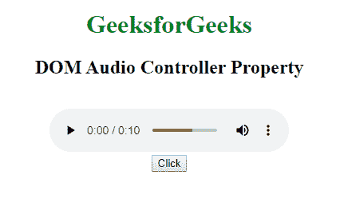
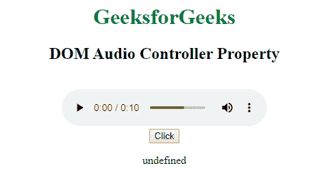

# HTML | DOM 音频控制器属性

> 原文:[https://www . geesforgeks . org/html-DOM-audio-controller-property/](https://www.geeksforgeeks.org/html-dom-audio-controller-property/)

控制器属性返回音频的当前媒体控制器。默认情况下，音频元素没有媒体控制器。媒体控制器属性将返回一个媒体控制器对象。

**语法:**

```html
audioObject.controller
```

**返回值:**

*   **MediaController:** 表示音频的媒体控制器。
    **对象:**媒体控制器对象属性/方法:

*   缓冲–获取音频的缓冲范围
*   可搜索–获取音频的可搜索范围
*   持续时间–获取音频的持续时间
*   当前时间–获取或设置音频的播放位置
*   暂停–检查音频是否暂停
*   播放()–播放音频
*   暂停()–暂停音频
*   播放–检查音频是否已播放
*   默认回放速率–获取或设置音频的默认回放速率
*   回放速率–获取或设置音频的当前回放速率
*   音量–获取或设置音频的音量
*   静音–获取或设置音频是否静音

**示例:**

```html
<!DOCTYPE html>
<html>

<head>
    <title>
        DOM Audio Controller Property
    </title>
</head>

<body style="text-align:center">

    <h1 style="color:green"> 
        GeeksforGeeks 
    </h1>

    <h2> 
        DOM Audio Controller Property
    </h2>
    <br>

    <audio id="audioid" controls>
        <source src=
"https://media.geeksforgeeks.org/wp-content/uploads/20190625153922/frog.mp3"
                    type="audio/ogg">

        <source src=
"https://media.geeksforgeeks.org/wp-content/uploads/20190625153922/frog.mp3"
                    type="audio/mpeg"> 
    </audio>
    <br>

    <button onclick="GFGaudio()">Click</button>

    <p id="demo"></p>

    <script>
        function GFGaudio() {
            var gfg = document.getElementById("audioid").controller;
            document.getElementById("demo").innerHTML = gfg;
        }
    </script>
</body>

</html>
```

**输出:**

*   **点击按钮前:**
    
*   **点击按钮后:**
    

**支持的浏览器:****HTML DOM 音频控制器属性**支持的浏览器如下:

*   谷歌 Chrome
*   微软公司出品的 web 浏览器
*   火狐浏览器
*   苹果 Safari
*   歌剧