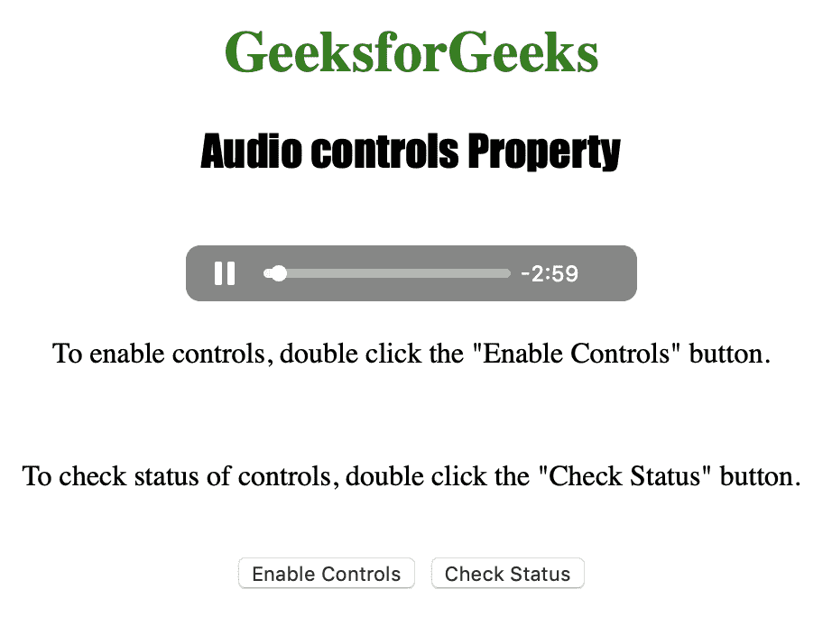
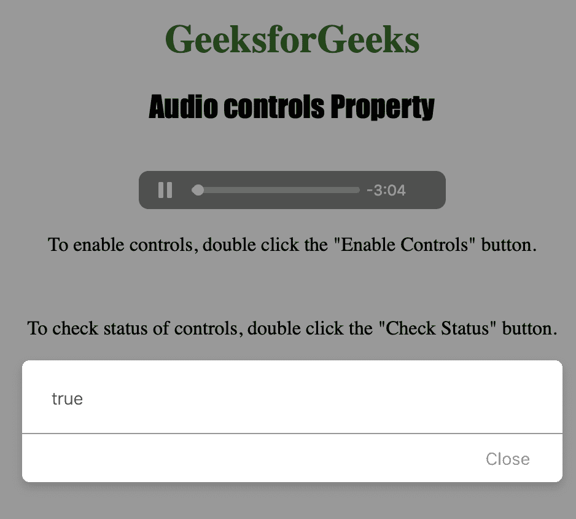

# HTML | DOM 音频控件属性

> 原文:[https://www . geesforgeks . org/html-DOM-audio-controls-property/](https://www.geeksforgeeks.org/html-dom-audio-controls-property/)

**音频控件属性**用于**设置**或**返回**音频是否显示标准音频控件。该属性反映了<音频>控件属性。
属性中包含的音频控件有:

1.  玩
2.  中止
3.  寻找
4.  卷

**语法:**

*   返回控件属性:

    ```html
    audioObject.controls
    ```

*   设置控制属性:

    ```html
    audioObject.controls = true|false
    ```

**属性值:**

1.  **true|false:** It is used to specify whether an audio should have controls displayed, or not.

    **返回值:**如果显示音频控件，则返回布尔值为真，否则返回假

下面的程序说明了音频控件属性:
**示例:**启用音频控件。

```html
<!DOCTYPE html>
<html>

<head>
    <title>
        Audio controls Property
    </title>
</head>

<body style="text-align: center">

    <h1 style="color: green">
      GeeksforGeeks
    </h1>
    <h2 style="font-family: Impact">
      Audio controls Property
    </h2>
    <br>

    <audio id="Test_Audio" 
           controls autoplay>

        <source src="sample1.ogg"
                type="audio/ogg">

        <source src="sample1.mp3" 
                type="audio/mpeg">
    </audio>

    <p>To enable controls, double click
      the "Enable Controls" button.</p>
    <br>

    <p>To check status of controls, double
      click the "Check Status" button.</p>
    <br>

    <button ondblclick="Enable_Audio()">
      Enable Controls
    </button>
    <button ondblclick="Check_Audio()">
      Check Status
    </button>

    <p id="test"></p>

    <script>
        var a = document.getElementById("Test_Audio");

        function Enable_Audio() {
            a.controls = true;
            a.load();
        }

        function Check_Audio() {
            alert(a.controls);
        }
    </script>

</body>

</html>
```

**输出:**

*   点击按钮前:
    
*   点击按钮后:
    

**支持的浏览器:**以下列出了 *HTML | DOM 音频控件属性*支持的浏览器:

*   谷歌 Chrome
*   微软公司出品的 web 浏览器
*   火狐浏览器
*   歌剧
*   苹果 Safari