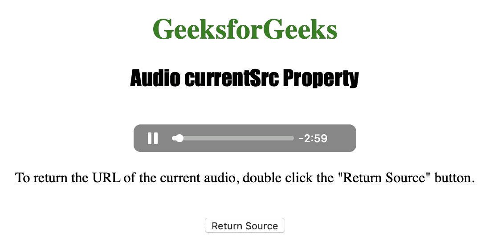
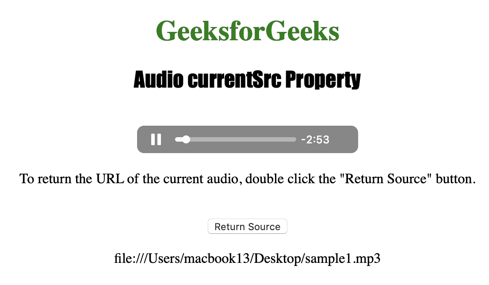

# HTML | DOM 音频电流 rc 属性

> 原文:[https://www . geesforgeks . org/html-DOM-audio-current src-property/](https://www.geeksforgeeks.org/html-dom-audio-currentsrc-property/)

**音频流属性**用于*返回当前音频的网址*。如果未指定音频，Audio currentSrc 属性将返回一个空字符串。
音频电流 rc 属性是只读属性。

**语法:**

```html
audioObject.currentSrc
```

下面的程序举例说明了音频的当前属性:
**示例:**获取当前音频的网址。

```html
<!DOCTYPE html>
<html>

<head>
    <title>
        Audio currentSrc Property
    </title>
</head>

<body style="text-align: center">

    <h1 style="color: green">
      GeeksforGeeks
  </h1>
    <h2 style="font-family: Impact">
      Audio currentSrc Property
  </h2>
    <br>

    <audio id="Test_Audio" 
           controls autoplay>
        <source src="sample1.ogg" 
                type="audio/ogg">
        <source src="sample1.mp3" 
                type="audio/mpeg">
    </audio>

    <p>To return the URL of the current audio,
      double click the "Return Source" button.</p>
    <br>

    <button ondblclick="My_Audio()">
      Return Source
  </button>

    <p id="test"></p>

    <script>
        function My_Audio() {
            var a = 
                document.getElementById(
                  "Test_Audio").currentSrc;
            document.getElementById("test").innerHTML = a;
        }
    </script>

</body>

</html>
```

**输出:**

*   点击按钮前:
    
*   点击按钮后:
    

**支持的浏览器:**以下是*HTML | DOM Audio current RC Property*支持的浏览器:

*   谷歌 Chrome
*   微软公司出品的 web 浏览器
*   火狐浏览器
*   歌剧
*   苹果 Safari