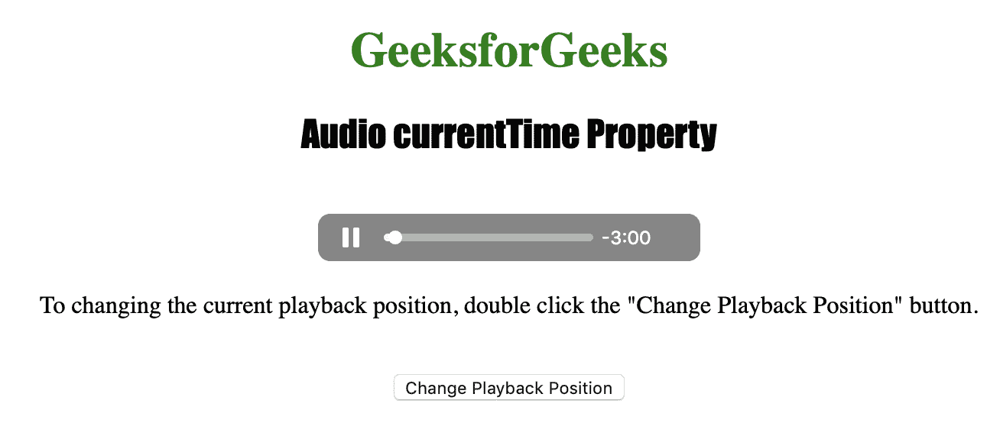
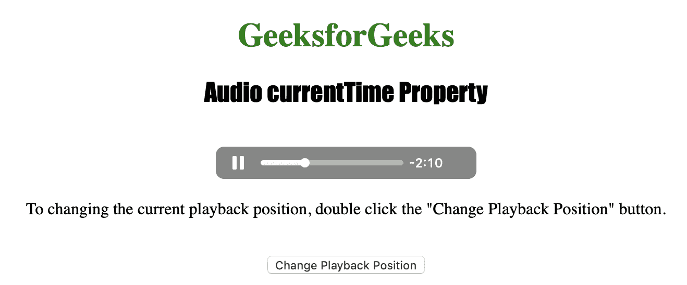

# HTML | DOM 音频 currentTime 属性

> 原文:[https://www . geesforgeks . org/html-DOM-audio-current time-property/](https://www.geeksforgeeks.org/html-dom-audio-currenttime-property/)

**音频当前时间属性**用于**设置**或**返回** *音频播放的当前位置*。Audio currentTime 属性以秒的形式返回音频播放位置。
设置该属性时，播放跳转到指定位置。

**语法:**

*   返回 currentTime 属性:

    ```html
    audioObject.currentTime
    ```

*   设置 currentTime 属性:

    ```html
    audioObject.currentTime = seconds
    ```

**属性值:**

*   **秒:**用于以秒为单位指定视频播放的位置。

下面的程序说明了音频电流时间属性:
**示例:**将时间位置设置为 50 秒。

```html
<!DOCTYPE html>
<html>

<head>
    <title>
        Audio currentTime Property
    </title>
</head>

<body style="text-align: center">

    <h1 style="color: green">
      GeeksforGeeks
    </h1>
    <h2 style="font-family: Impact">
      Audio currentTime Property
    </h2>
    <br>

    <audio id="Test_Audio" 
           controls autoplay>
        <source src="sample1.ogg" 
                type="audio/ogg">
        <source src="sample1.mp3" 
                type="audio/mpeg">
    </audio>

    <p>To changing the current playback position, 
      double click the "Change Playback Position" 
      button.</p>
    <br>

    <button ondblclick="My_Audio()">
      Change Playback Position
    </button>

    <p id="test"></p>

    <script>
        var a = document.getElementById("Test_Audio");

        function My_Audio() {
            a.currentTime = 50;
        }
    </script>

</body>

</html>
```

**输出:**

*   点击按钮前:
    
*   点击按钮后:
    

**支持的浏览器:**由 *HTML | DOM Audio currentTime 属性*支持的浏览器如下:

*   谷歌 Chrome
*   微软公司出品的 web 浏览器
*   火狐浏览器
*   歌剧
*   苹果 Safari