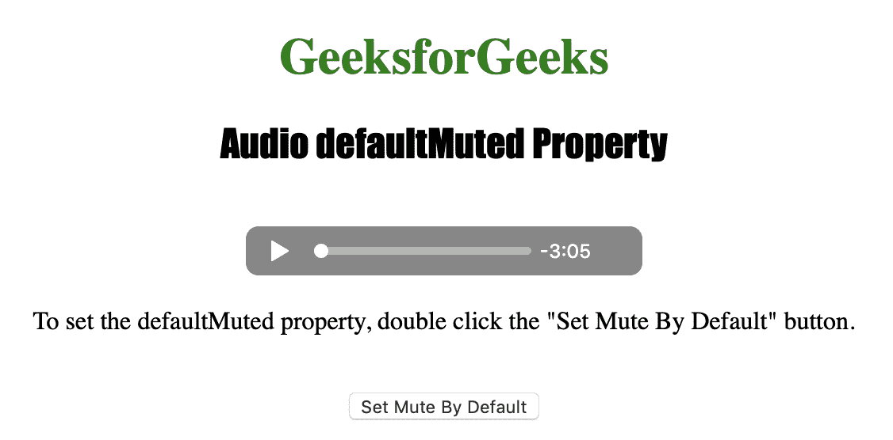
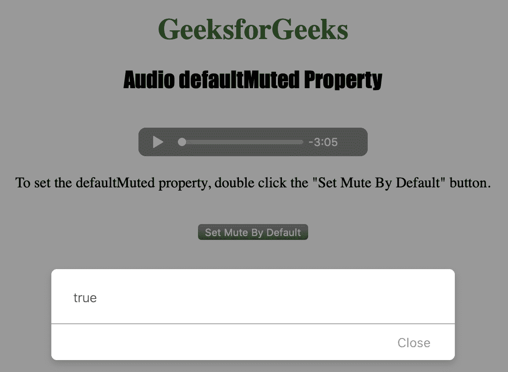

# HTML | DOM 音频默认静音属性

> 原文:[https://www . geesforgeks . org/html-DOM-audio-defaultmuted-property/](https://www.geeksforgeeks.org/html-dom-audio-defaultmuted-property/)

**音频默认静音属性**用于**设置**或**返回***是否默认静音*。
音频 defaultMuted 属性不能改变当前静音状态，它只影响默认静音状态。

**语法:**

*   返回静音属性:

    ```html
    audioObject.defaultMuted
    ```

*   设置默认静音属性:

    ```html
    audioObject.defaultMuted = true|false
    ```

**属性值:**

*   **true|false:** 用于指定音频是否一加载就自动开始播放。

下面的程序说明了音频默认静音属性:
**示例:**将音频设置为默认静音。

```html
<!DOCTYPE html>
<html>

<head>
    <title>
        Audio defaultMuted Property
    </title>
</head>

<body style="text-align: center">

    <h1 style="color: green">
      GeeksforGeeks
    </h1>
    <h2 style="font-family: Impact">
      Audio defaultMuted Property
    </h2>
    <br>

    <audio id="Test_Audio" controls>
        <source src="sample1.ogg" type="audio/ogg">
        <source src="sample1.mp3" type="audio/mpeg">
    </audio>

    <p>To set the defaultMuted property, 
      double click the "Set Mute By Default" button.</p>
    <br>

    <button ondblclick="My_Audio()">
      Set Mute By Default
    </button>

    <p id="test"></p>

    <script>
        var a = document.getElementById("Test_Audio");

        function My_Audio() {
            a.defaultMuted = true;
            a.load()
            alert(a.defaultMuted);
        }
    </script>

</body>

</html>
```

**输出:**

*   点击按钮前:
    
*   点击按钮后:
    

**支持的浏览器:**以下列出了*HTML | DOM Audio defaultmuded Property*支持的浏览器:

*   谷歌 Chrome
*   火狐浏览器
*   歌剧
*   苹果 Safari