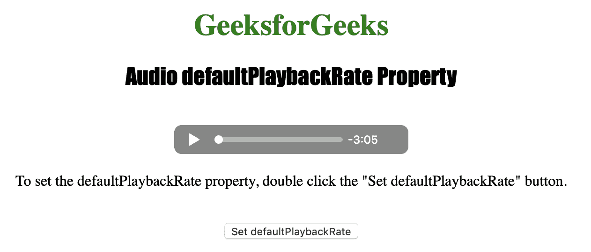

# HTML | DOM 音频 default play rate property

> 原文:[https://www . geesforgeks . org/html-DOM-audio-defaultplaybackrate-property/](https://www.geeksforgeeks.org/html-dom-audio-defaultplaybackrate-property/)

**音频默认播放回放速度属性**用于**设置**或**返回** *音频的默认播放速度*。Audio defaultPlaybackRate 属性仅更改默认播放速度，而不更改当前播放速度。

**语法:**

*   返回 defaultPlaybackRate 属性:

    ```html
    audioObject.defaultPlaybackRate
    ```

*   设置 defaultPlaybackRate 属性:

    ```html
    audioObject.defaultPlaybackRate = number
    ```

**属性值:**

1.  **编号:**用于指定视频的默认播放速度。
    可用选项有:

*   1.0 是正常速度。
*   0.5 是半速。
*   2.0 是双倍速度。
*   -1.0 是倒退，正常速度。
*   -0.5 是倒退，半速。

以下程序说明了音频默认播放回放速率属性:

**例 1:** 默认将音频设置为倍速。

```html
<!DOCTYPE html>
<html>

<head>
    <title>
        Audio defaultPlaybackRate Property
    </title>
</head>

<body style="text-align: center">

    <h1 style="color: green">
      GeeksforGeeks
    </h1>
    <h2 style="font-family: Impact">
      Audio defaultPlaybackRate Property
    </h2>
    <br>

    <audio id="Test_Audio" controls>
        <source src="sample1.ogg"
                type="audio/ogg">

        <source src="sample1.mp3" 
                type="audio/mpeg">
    </audio>

    <p>To set the defaultPlaybackRate property, 
      double click the "Set defaultPlaybackRate"
      button.</p>
    <br>

    <button ondblclick="My_Audio()">
      Set defaultPlaybackRate
    </button>

    <p id="test"></p>

    <script>
        var a = document.getElementById("Test_Audio");

        function My_Audio() {
            a.defaultPlaybackRate = 2.0;
            a.load();
            alert(a.defaultPlaybackRate);
        }
    </script>

</body>

</html>
```

**输出:**

*   点击按钮前:
    
*   点击按钮后:
    

**示例 2:** 默认返回音频回放速度。

```html
<!DOCTYPE html>
<html>

<head>
    <title>
        Audio defaultPlaybackRate Property
    </title>
</head>

<body style="text-align: center">

    <h1 style="color: green">
      GeeksforGeeks
    </h1>
    <h2 style="font-family: Impact">
      Audio defaultPlaybackRate Property
    </h2>
    <br>

    <audio id="Test_Audio" controls>
        <source src="sample1.ogg"
                type="audio/ogg">

        <source src="sample1.mp3" 
                type="audio/mpeg">
    </audio>

    <p>To return the defaultPlaybackRate property, 
      double click the "Return defaultPlaybackRate"
      button.</p>
    <br>

    <button ondblclick="My_Audio()">
      Return defaultPlaybackRate
    </button>

    <p id="test"></p>

    <script>
        var a = document.getElementById("Test_Audio");

        function My_Audio() {
            a.defaultPlaybackRate;
            a.load();
            alert(a.defaultPlaybackRate);
        }
    </script>

</body>

</html>
```

**输出:**

*   点击按钮前:
    *   After clicking the button:
    

    **支持的浏览器:**以下列出了*HTML | DOM Audio default playback rate 属性*支持的浏览器:

    *   谷歌 Chrome
    *   微软公司出品的 web 浏览器
    *   火狐浏览器
    *   歌剧
    *   苹果 Safari