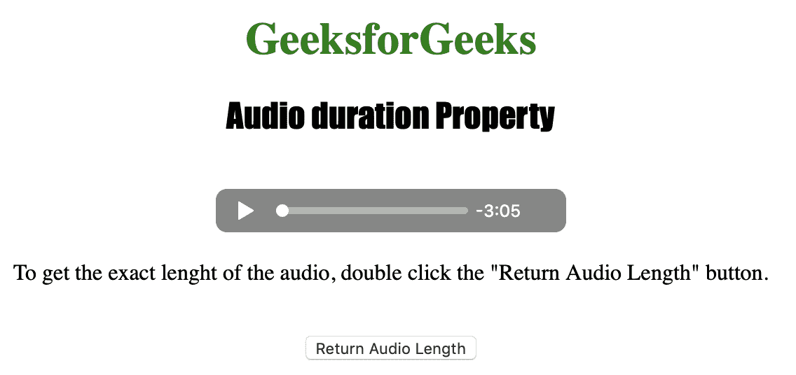
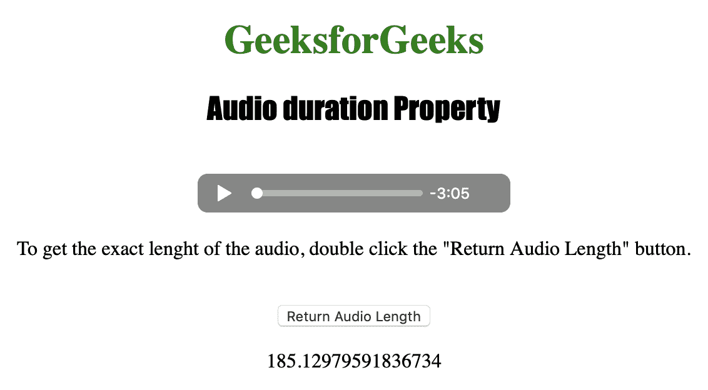

# HTML | DOM 音频时长属性

> 原文:[https://www . geesforgeks . org/html-DOM-audio-duration-property/](https://www.geeksforgeeks.org/html-dom-audio-duration-property/)

**音频持续时间属性**用于*返回音频的长度*。音频持续时间属性返回以秒为单位的值。
不同的浏览器返回不同的精度值，例如 safari 最多返回 14 位小数，opera 最多返回 9 位小数。
音频持续时间属性是只读属性。
如果没有设置视频，音频持续时间功能返回*“NAn”*，而如果音频是流式的并且没有预定义的长度，则返回*“Inf”*(无穷大)。

**语法:**

```html
audioObject.duration
```

下面的程序说明了音频持续时间属性:
**示例:**获取音频的长度。

```html
<!DOCTYPE html>
<html>

<head>
    <title>
        Audio duration Property
    </title>
</head>

<body style="text-align:center">

    <h1 style="color:green">
      GeeksforGeeks
    </h1>
    <h2 style="font-family: Impact">
      Audio duration Property
    </h2>
    <br>

    <audio id="Test_Audio" controls>
        <source src="sample1.ogg" 
                type="audio/ogg">
        <source src="sample1.mp3" 
                type="audio/mpeg">
    </audio>

    <p>To get the exact length of the audio,
      double click the "Return Audio Length" button.
    </p>
    <br>

    <button ondblclick="My_Audio()">
      Return Audio Length
    </button>

    <p id="test"></p>

    <script>
        var a = document.getElementById("Test_Audio");

        function My_Audio() {
            var a = document.getElementById(
              "Test_Audio").duration;
            document.getElementById("test").innerHTML = a;
        }
    </script>

</body>

</html>
```

**输出:**

*   点击按钮前:
    
*   点击按钮后:
    

**支持的浏览器:**下面列出了 *HTML | DOM 音频时长属性*支持的浏览器:

*   谷歌 Chrome
*   微软公司出品的 web 浏览器
*   火狐浏览器
*   歌剧
*   苹果 Safari