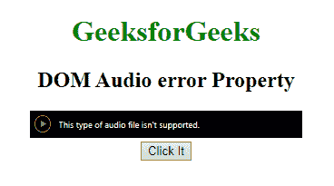
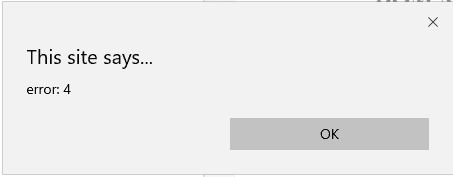

# HTML | DOM 音频错误属性

> 原文:[https://www . geesforgeks . org/html-DOM-audio-error-property/](https://www.geeksforgeeks.org/html-dom-audio-error-property/)

**DOM 音频错误属性**用于返回 MediaError 对象，MediaError 对象包含视频的错误状态。

**语法:**

```html
audio.error.code
```

**返回类型:**
**数字:**MediaError 对象返回一个代表视频错误状态的数字:

*   1 =媒体 _ 错误 _ 中止–用户中止了提取过程
*   2 =媒体 _ 错误 _ 网络–下载时出错
*   3 = MEDIA _ ERR _ DECODE–解码时出错
*   4 = MEDIA _ ERR _ SRC _ NOT _ SUPPORTED–不支持音频

**示例:**

```html
<!DOCTYPE html>
<html>

<body>

    <center>
        <h1 style="color:green">GeeksforGeeks</h1>
        <h2>DOM Audio error Property</h2>
        <audio id="my_Audio" controls autoplay>
            <source id="mp4_src"
                    src="gfg.ogg"
                    type="audio/mp3">

        </audio>
        <br>
        <button onclick="myAudio()" type="button">
            Click It
        </button>
        <br>

        <script>
            var a = document.getElementById("my_Audio");

            function myAudio() {
                alert("error: " + a.error.code);
            }
        </script>
    </center>
</body>

</html>
```

**输出:**

*   **之前点击按钮:**
    
*   **点击按钮后:**
    

**支持的浏览器:****HTML DOM Audio 错误属性**支持的浏览器如下:

*   微软公司出品的 web 浏览器