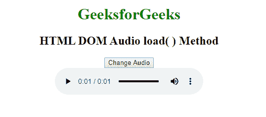

# HTML | DOM 音频加载()方法

> 原文:[https://www.geeksforgeeks.org/html-dom-audio-load-method/](https://www.geeksforgeeks.org/html-dom-audio-load-method/)

**音频加载()方法**用于重新加载音频元素。音频加载()方法用于在更改源或其他设置后更新音频元素。Audio load()方法不接受任何参数，也不返回值。
**语法**

```html
audio.load()
```

**例:**

## 超文本标记语言

```html
<!DOCTYPE html>
<html>

<body style="text-align:center;">

    <h1 style="color:green">GeeksforGeeks</h1>

    <h2>HTML DOM Audio load() Method</h2>

    <button onclick="my_Audio()" type="button">
        Change Audio
    </button>
    <br>

    <audio id="my_Audio" controls autoplay>
        <source id="mp4_src" src=
"https://media.geeksforgeeks.org/wp-content/uploads/20190531165842/Recording1514.ogg"
                    type="audio/mp3">

        <source id="ogg_src" src=
"https://media.geeksforgeeks.org/wp-content/uploads/20190625153922/frog.mp3"
                    type="audio/ogg">
    </audio>

    <script>
        function my_Audio() {
            document.getElementById("ogg_src").src =
"https://media.geeksforgeeks.org/wp-content/uploads/20190531165842/Recording1514.ogg";

            document.getElementById("mp4_src").src =
"https://media.geeksforgeeks.org/wp-content/uploads/20190625153922/frog.mp3";

            document.getElementById("my_Audio").load();
        }
    </script>
</body>

</html>
```

**输出:**



**支持的浏览器:**HTML DOM Audio load()方法支持的浏览器如下:

1.  谷歌 Chrome
2.  歌剧
3.  Mozilla Firefox