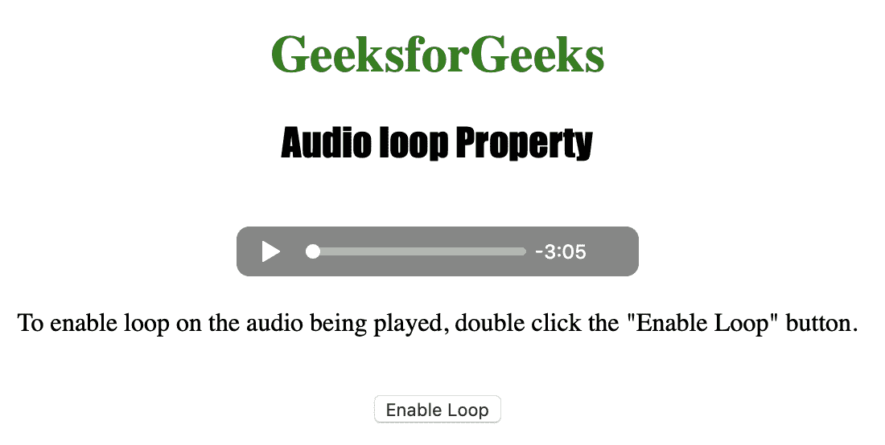
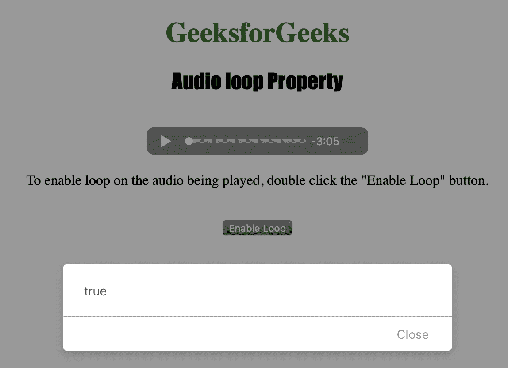
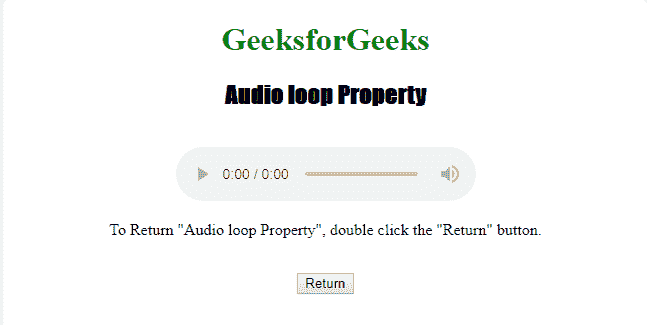
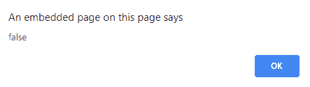

# HTML | DOM 音频循环属性

> 原文:[https://www.geeksforgeeks.org/html-dom-audio-loop-property/](https://www.geeksforgeeks.org/html-dom-audio-loop-property/)

**音频循环属性**用于**设置**或**返回** *音频结束后是否重新开始播放*。

**语法:**

*   返回循环属性:

    ```html
    audioObject.loop
    ```

*   设置循环属性:

    ```html
    audioObject.loop = true | false
    ```

**属性值**

1.  **true | false:** 用于指定音频是否应该重新开始播放，每次播放完毕与否。

**Return:** 如果音频再次开始播放，Audio loop 属性返回布尔值 true，每次播放完毕，否则返回 false。

下面的程序说明了音频循环属性:
**示例 1:** 将音频设置为循环。

```html
<!DOCTYPE html>
<html>

<head>
    <title>
        Audio loop Property
    </title>
</head>

<body style="text-align: center">

    <h1 style="color: green">
      GeeksforGeeks
    </h1>
    <h2 style="font-family: Impact">
      Audio loop Property
    </h2>
    <br>

    <audio id="Test_Audio" controls>
        <source src="sample1.ogg" 
                type="audio/ogg">

        <source src="sample1.mp3" 
                type="audio/mpeg">
    </audio>

    <p>To enable loop on the audio being played,
      double click the "Enable Loop" button.</p>
    <br>

    <button ondblclick="My_Audio()">
      Enable Loop
    </button>

    <p id="test"></p>

    <script>
        function My_Audio() {
            var a = document.getElementById("Test_Audio");
            a.loop = true;
            a.load();
            alert(a.loop);
        }
    </script>

</body>

</html>
```

**输出:**

*   点击按钮前:
    
*   点击按钮后:
    

**示例 2:** 将音频返回循环。

```html
<!DOCTYPE html>
<html>

<head>
    <title>
        Audio loop Property
    </title>
</head>

<body style="text-align:center">

    <h1 style="color:green">GeeksforGeeks</h1>
    <h2 style="font-family: Impact">Audio loop Property</h2>
    <br>

    <audio id="Test_Audio" controls>
        <source src="sample1.ogg" type="audio/ogg">
        <source src="sample1.mp3" type="audio/mpeg">
    </audio>

    <p>To Return "Audio loop Property", 
    double click the "Return" button.</p>
    <br>

    <button ondblclick="My_Audio()">Return</button>

    <p id="test"></p>

    <script>
        function My_Audio() {
            var a = document.getElementById("Test_Audio");
            a.loop;
            a.load();
            alert(a.loop);
        }
    </script>

</body>

</html>
```

**输出:**

*   点击按钮前:
    
*   点击按钮后:
    

**支持的浏览器:**以下是 *HTML | DOM 音频循环属性*支持的浏览器:

*   谷歌 Chrome
*   微软公司出品的 web 浏览器
*   火狐浏览器
*   歌剧
*   苹果 Safari