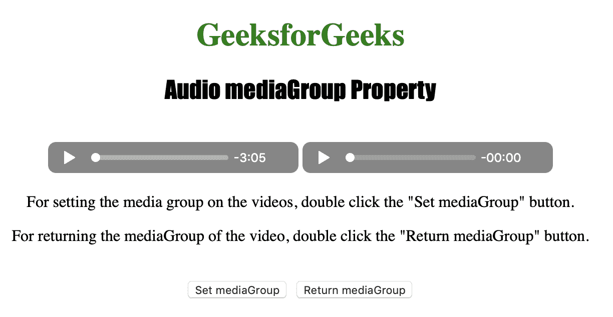
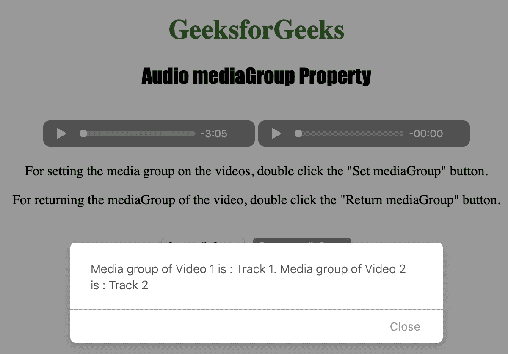

# HTML | DOM 音频媒体组属性

> 原文:[https://www . geesforgeks . org/html-DOM-audio-media group-property/](https://www.geeksforgeeks.org/html-dom-audio-mediagroup-property/)

**音频媒体组属性**用于**设置**或**返回** *音频所属媒体组的名称。
两个或更多<音频>元素可以使用一个媒体组同步在一起。*

**语法:**

*   返回 mediaGroup 属性:

    ```html
    audioObject.mediaGroup
    ```

*   设置 mediaGroup 属性:

    ```html
    audioObject.mediaGroup = group
    ```

**属性值:**

*   **组:**用于指定视频的媒体组。

**返回:**音频媒体组属性返回一个代表音频媒体组的字符串。

下面的程序说明了音频媒体组属性:
**示例:**为 2 个<音频>元素设置媒体组。

```html
<!DOCTYPE html>
<html>

<head>
    <title>
        Audio mediaGroup Property
    </title>
</head>

<body style="text-align: center">

    <h1 style="color: green">
      GeeksforGeeks
    </h1>
    <h2 style="font-family: Impact">
      Audio mediaGroup Property
    </h2>
    <br>

    <audio id="Test_Audio1" controls>
        <source src="sample1.ogg" type="audio/ogg">
        <source src="sample1.mp3" type="audio/mpeg">
    </audio>

    <audio id="Test_Audio2" controls>
        <source src="sample2.ogg" type="audio/ogg">
        <source src="sample2.mp3" type="audio/mpeg">
    </audio>

    <p>For setting the media group on the videos, 
      double click the "Set mediaGroup" button.</p>

    <p>For returning the mediaGroup of the video, 
      double click the "Return mediaGroup" button.</p>
    <br>

    <button ondblclick="set()" type="button">
      Set mediaGroup
    </button>
    <button ondblclick="get()" type="button">
      Return mediaGroup
    </button>

    <script>
        var v1 = document.getElementById("Test_Audio1");
        var v2 = document.getElementById("Test_Audio2");

        function set() {
            v1.mediaGroup = "Track 1";
            v2.mediaGroup = "Track 2";
        }

        function get() {
            alert("Media group of Video 1 is : " + v1.mediaGroup +
                ". Media group of Video 2 is : " + v2.mediaGroup);
        }
    </script>

</body>

</html>
```

**输出:**

*   点击按钮前:
    
*   点击按钮后:
    

**支持的浏览器:**以下是 *HTML | DOM 音频媒体集团属性*支持的浏览器:

*   谷歌 Chrome
*   微软公司出品的 web 浏览器
*   火狐浏览器
*   歌剧
*   苹果 Safari