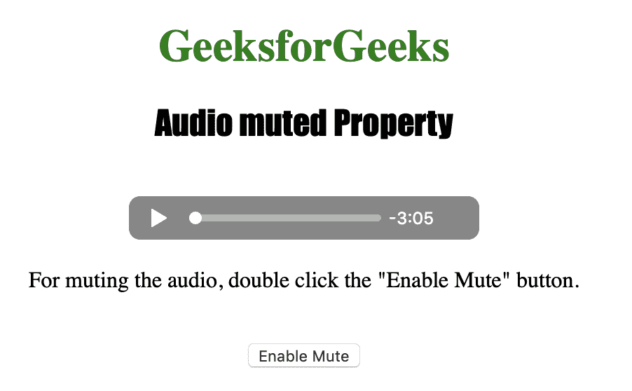
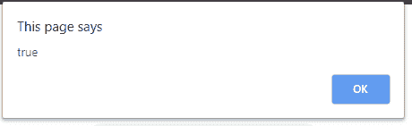

# HTML | DOM 音频静音属性

> 原文:[https://www . geesforgeks . org/html-DOM-audio-muted-property/](https://www.geeksforgeeks.org/html-dom-audio-muted-property/)

**音频静音属性**用于设置或返回音频输出是否静音。

**语法:**

*   它返回静音属性。

    ```html
    audioObject.muted
    ```

*   它设置静音属性。

    ```html
    audioObject.muted = true|false
    ```

**属性值:**该属性接受值**真|假**，用于指定音频输出是否静音。
**返回:**如果音频静音，音频静音属性返回布尔值 true，否则返回 false。
下面的程序说明了 HTML DOM 中的音频静音属性:

**示例:**本示例关闭音频声音。

```html
<!DOCTYPE html>
<html>

<head>     
    <title>
        HTML DOM Audio muted Property
    </title>
</head>

<body style="text-align:center;">

    <h1 style="color:green;">
        GeeksforGeeks
    </h1> 

    <h2 style="font-family: impact;">
        Audio muted Property
    </h2><br>

    <audio id="Test_Audio" controls>
        <source src="gfg.ogg" type="audio/ogg">
        <source src="gfg.mp3" type="audio/mpeg">
    </audio>

    <p>
        For muting the audio, double click
        the "Enable Mute" button.
    </p>
    <br>

    <button ondblclick="MyAudio()" type="button">
        Enable Mute
    </button>

    <script>
        var a = document.getElementById("Test_Audio");

        function MyAudio() { 
            a.muted = true;
            alert(a.muted);
        } 
    </script>
</body>

</html>                                                       
```

**输出:**

*   点击按钮前:
    
*   点击按钮后:
    

**支持的浏览器:***DOM Audio 静音属性*支持的浏览器如下:

*   谷歌 Chrome
*   微软公司出品的 web 浏览器
*   火狐浏览器
*   苹果 Safari
*   歌剧