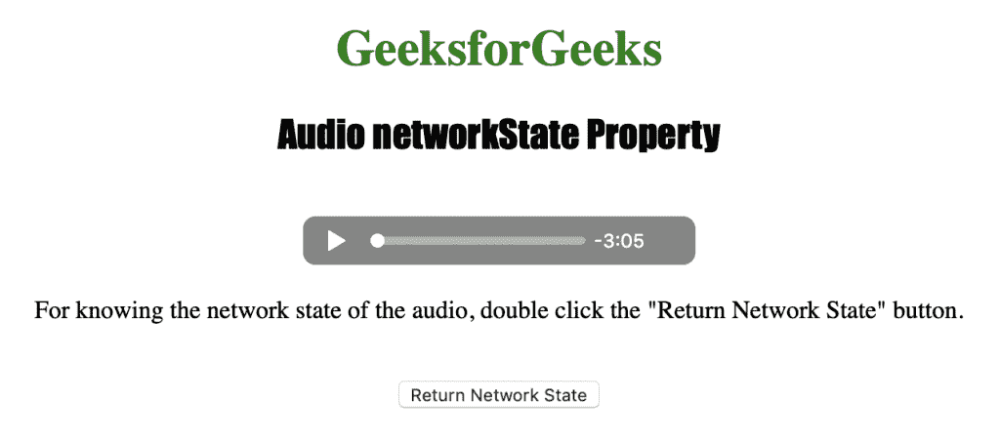
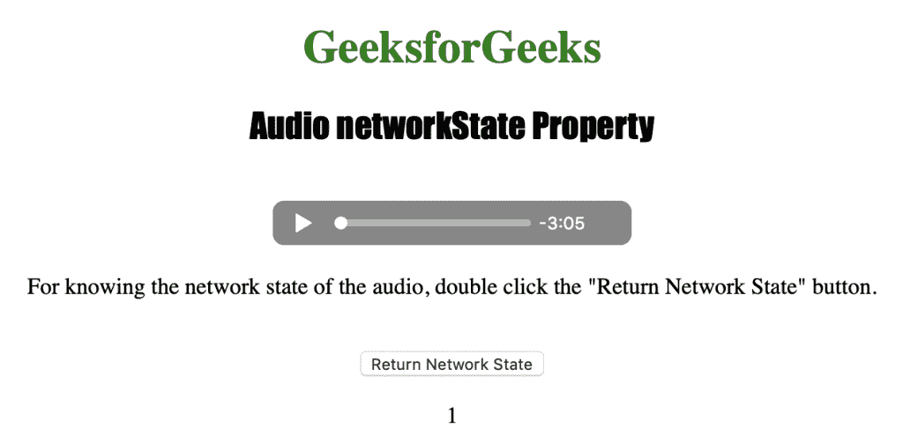

# HTML | DOM 音频网络状态属性

> 原文:[https://www . geesforgeks . org/html-DOM-audio-network state-property/](https://www.geeksforgeeks.org/html-dom-audio-networkstate-property/)

**音频网络状态属性**用于返回音频的当前网络状态。

**语法:**

```html
audioObject.networkState
```

**返回值:**音频网络状态返回一个可能具有以下值的数字:

*   **0 = NETWORK_EMPTY:** 表示音频尚未初始化。
*   **1 = NETWORK_IDLE:** 表示音频处于活动状态，并已选择资源，但未使用网络。
*   **2 = NETWORK_LOADING:** 表示浏览器正在下载数据。
*   **3 = NETWORK_NO_SOURCE:** 表示没有找到音频源。

下面的程序说明了音频**网络状态**属性。

**示例:**获取音频的当前网络状态。

```html
<!DOCTYPE html>
<html>

<head>     
    <title>
        HTML Audio DOM networkState Property
    </title>
</head>

<body style="text-align:center;">

    <h1 style="color:green;">
        GeeksforGeeks
    </h1> 

    <h2 style="font-family: Impact;">
        Audio networkState Property
    </h2>
    <br>

    <audio id="Test_Audio" controls>
        <source src="gfg.ogg" type="audio/ogg">
        <source src="gfg.mp3" type="audio/mpeg">
    </audio>

    <p>
        For knowing the network state of the
        audio, double click the "Return Network
        State" button.
    </p>
    <br>

    <button ondblclick="MyAudio()" type="button">
        Return Network State
    </button>

    <p id="test"></p>

    <script>
    function MyAudio() { 
        var a = 
            document.getElementById("Test_Audio").networkState;

        document.getElementById("test").innerHTML = a;
    } 
    </script>
</body>

</html>                                                  
```

**输出:**

*   点击按钮前:
    
*   点击
    按钮后

**支持的浏览器:**T2 DOM 音频网络状态属性支持的浏览器如下:

*   谷歌 Chrome
*   Internet Explorer 9.0
*   Firefox 3.5
*   歌剧
*   苹果 Safari