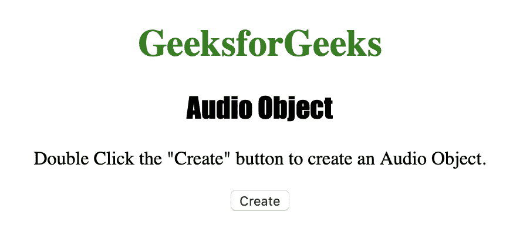
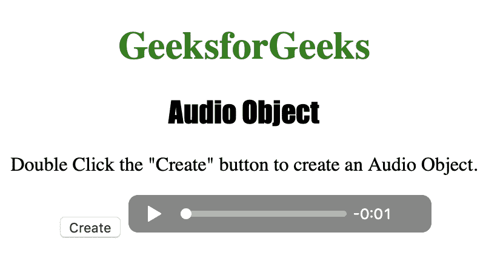
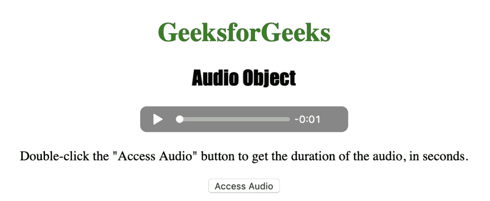
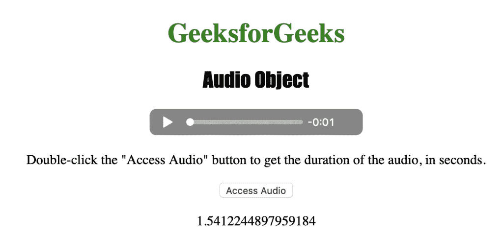

# HTML | DOM 音频对象

> 原文:[https://www.geeksforgeeks.org/html-dom-audio-object/](https://www.geeksforgeeks.org/html-dom-audio-object/)

**音频对象**用于表示 **HTML <音频>T3】元素。
音频对象是 **HTML5** 中的新对象。**

**语法:**

*   用于创建

    <audio>元素:

    ```html
    var gfg = document.createElement("AUDIO")
    ```

    </audio>

*   用于访问

    <audio>元素:

    ```html
    var x = document.getElementById("myAudio")
    ```

    </audio>

**属性值:**

| 价值 | 描述 |
| 音频轨道 | 它用于返回代表可用音频轨道的音频轨道列表对象。 |
| 自动播放 | 它用于设置或返回音频是否应在准备就绪后立即开始播放。 |
| 减轻 | 它用于返回代表音频缓冲部分的时间范围对象。 |
| 控制器 | 它用于返回表示音频的当前媒体控制器的 MediaController 对象。 |
| 控制 | 它用于设置或返回音频是否应该显示控制(播放/暂停等)。 |
| 交叉原点 | 它用于设置或返回音频的 CORS 设置。 |
| 电流 rc | 用于返回当前音频的网址。 |
| 当前时间 | 它用于设置或返回音频中的当前播放位置(以秒为单位)。 |
| 默认静音 | 它用于设置或返回音频是否默认静音。 |
| defaultPlaybackRate | 它用于设置或返回搜索字段是否为只读。 |
| 期间 | 它用于返回音频的长度(秒)。 |
| 结束 | 用于返回音频播放是否结束。 |
| 错误 | 它用于返回表示音频错误状态的 MediaError 对象。 |
| 环 | 它用于设置或返回音频是否应该在每次结束时重新开始播放。 |
| 媒体组 | 它用于设置或返回音频所属媒体组的名称。 |
| 柔和的 | 它用于设置或返回是否应该关闭声音。 |
| 网络状态 | 它用于返回音频的当前网络状态。 |
| 暂停 | 它用于设置或返回音频是否暂停。 |
| 回放速率 | 它用于设置或返回音频播放速度。 |
| 演奏 | 它用于返回代表音频播放部分的时间范围对象。 |
| 事先装好 | 它用于设置或返回音频的预加载属性值。 |
| 就绪状态 | 它用于设置或返回音频的当前就绪状态。 |
| 看起来不错 | 它用于返回代表音频中可查找部分的时间范围对象。 |
| 寻找 | 它用于返回用户当前是否在音频中寻找。 |
| 科学研究委员会 | 它用于设置或返回音频的 src 属性值。 |
| 文本轨道 | 它用于返回表示可用文本轨道的文本轨道列表对象。 |
| 卷 | 它用于设置或返回音频的音量。 |

**音频对象方法:**

| 价值 | 描述 |
| 添加文本轨道() | 它用于向音频添加新的文本轨道。 |
| canPlayType() | 用于检查浏览器是否可以播放指定的音频类型。 |
| fastSeek() | 它用于在音频播放器中查找到指定的时间。 |
| getStartDate() | 它用于返回一个新的日期对象，表示当前的时间线偏移。 |
| 负载() | 它用于重新加载音频元素。 |
| 播放() | 它用于开始播放音频。 |
| 暂停() | 它用于暂停当前播放的音频。 |

下面的程序说明了音频对象:
**示例-1:创建一个<音频>元素。**

```html
<!DOCTYPE html>
<html>

<head>
    <title>Audio Object</title>
    <style>
        h1 {
            color: green;
        }

        h2 {
            font-family: Impact;
        }

        body {
            text-align: center;
        }
    </style>
</head>

<body>

    <h1>GeeksforGeeks</h1>
    <h2>Audio Object</h2>

    <p>Double Click the "Create" 
      button to create an Audio Object.</p>

    <button ondblclick="Create()">
      Create
  </button>

    <script>
        function Create() {

            // Create audio element.
            var m = document.createElement(
              "AUDIO");

            if (m.canPlayType("audio/mpeg")) {
                m.setAttribute("src", "bells.mp3");
            } else {
                m.setAttribute("src", "bells.ogg");
            }

            m.setAttribute("controls", "controls");
            document.body.appendChild(m);
        }
    </script>

</body>

</html>
```

**输出:**

*   点击按钮前:
    
*   点击按钮后:
    

**示例-2:访问<音频>元素。**

```html
<!DOCTYPE html>
<html>

<head>
    <title>Audio Object</title>
    <style>
        h1 {
            color: green;
        }

        h2 {
            font-family: Impact;
        }

        body {
            text-align: center;
        }
    </style>
</head>

<body>

    <h1>GeeksforGeeks</h1>
    <h2>Audio Object</h2>

    <audio id="track" controls>
        <source src="bells.ogg" type="audio/ogg">
        <source src="bells.mp3" type="audio/mpeg">
      Your browser does not support the audio element.
    </audio>

    <p>Double-click the "Access Audio" button 
      to get the duration of the audio, in seconds.</p>

     <button onclick="access()">Access Audio</button>

    <p id="test"></p>

    <script>
        function access() {

            // Accessing audio element duration.
            var m = document.getElementById(
              "track").duration;
            document.getElementById("test").innerHTML = m;
        }
    </script>

</body>

</html>
```

**输出:**

*   点击按钮前:
    
*   点击按钮后:
    

**支持的浏览器:***HTML | DOM 音频对象*支持的浏览器如下:

*   谷歌 Chrome
*   微软公司出品的 web 浏览器
*   火狐浏览器
*   歌剧
*   苹果 Safari