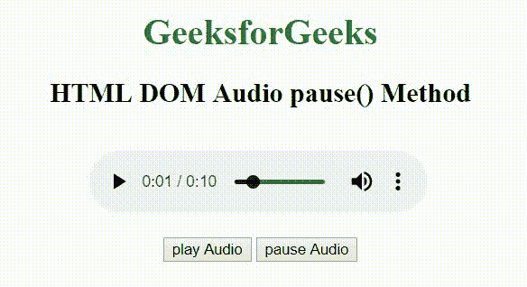

# HTML | DOM 音频暂停()方法

> 原文:[https://www.geeksforgeeks.org/html-dom-audio-pause-method/](https://www.geeksforgeeks.org/html-dom-audio-pause-method/)

**HTML DOM 音频暂停()方法**用于暂停当前播放的音频。若要使用 audio pause()方法，必须使用 controls 属性显示附加在音频上的音频控件，如播放、暂停、音量等。音频暂停()方法不接受任何参数，也不返回任何值。
**语法:**

```html
audio.pause()
```

**参数:**该方法不接受任何参数。
**返回值:**此方法不返回值。
**示例:**下面的示例说明了音频暂停()方法的使用。

## 超文本标记语言

```html
<!DOCTYPE html>
<html>

<head>
    <title>
        Audio paused method
    </title>
</head>

<body style="text-align: center">

    <h1 style="color: green">
        GeeksforGeeks
    </h1>

    <h2>HTML DOM Audio pause() Method</h2>
    <br>

    <audio id="Test_Audio" controls>
        <source src=
"https://media.geeksforgeeks.org/wp-content/uploads/20190625153922/frog.mp3"
        type="audio/mpeg">
    </audio>

    <br><br>

    <button ondblclick="play()" type="button">
        play Audio
    </button>

    <button ondblclick="pause()" type="button">
        pause Audio
    </button>

    <p id="test"></p>

    <script>
        var gfg = document.getElementById("Test_Audio");

        function play() {
            gfg.play();
        }
        function pause() {
            gfg.pause();
        }
    </script>
</body>

</html>
```

**输出:**



**支持的浏览器:**HTML DOM 音频暂停()方法支持的浏览器如下:

*   谷歌 Chrome
*   Internet Explorer 9.0
*   火狐浏览器
*   苹果 Safari
*   歌剧