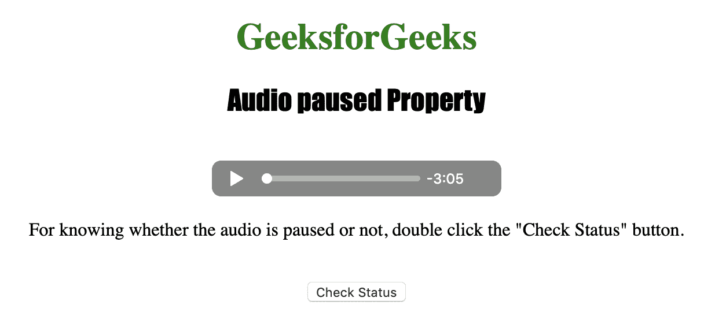
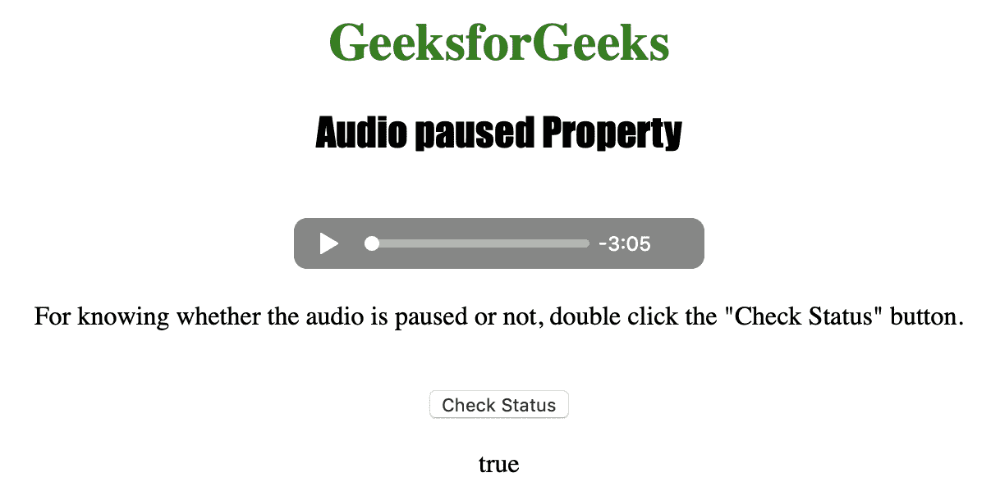

# HTML | DOM 音频暂停属性

> 原文:[https://www . geesforgeks . org/html-DOM-audio-暂停-property/](https://www.geeksforgeeks.org/html-dom-audio-paused-property/)

**音频暂停属性**用于*返回音频是否暂停*。音频暂停属性是只读属性。

**语法:**

```html
audioObject.paused
```

**返回:**音频暂停属性返回布尔值 true。如果音频暂停，则返回 false。

下面的程序说明了音频暂停属性:
**示例:**找出音频是否暂停。

```html
<!DOCTYPE html>
<html>

<head>
    <title>
        Audio paused Property
    </title>
</head>

<body style="text-align: center">

    <h1 style="color: green">
      GeeksforGeeks
    </h1>
    <h2 style="font-family: Impact">
      Audio paused Property
    </h2>
    <br>

    <audio id="Test_Audio" controls>
        <source src="sample1.ogg" 
                type="audio/ogg">

        <source src="sample1.mp3" 
                type="audio/mpeg">
    </audio>

    <p>For knowing whether the audio is paused or not, 
      double click the "Check Status" button.</p>
    <br>

    <button ondblclick="MyAudio()" 
            type="button">
      Check Status
    </button>

    <p id="test"></p>

    <script>
        function MyAudio() {
            var a = document.getElementById("Test_Audio").paused;
            document.getElementById("test").innerHTML = a;
        }
    </script>

</body>

</html>
```

**输出:**

*   点击按钮前:
    
*   点击按钮后:
    

**支持的浏览器:**支持的浏览器 *HTML | DOM Audio 暂停属性*如下:

*   谷歌 Chrome
*   微软公司出品的 web 浏览器
*   火狐浏览器
*   歌剧
*   苹果 Safari