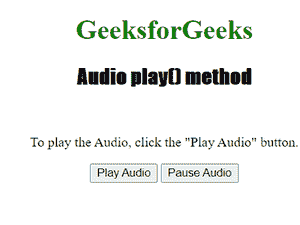

# HTML | DOM 音频播放()方法

> 原文:[https://www.geeksforgeeks.org/html-dom-audio-play-method/](https://www.geeksforgeeks.org/html-dom-audio-play-method/)

**HTML DOM 音频播放()方法**用于开始播放当前音频。若要使用 Audio play()方法，必须使用 controls 属性来显示附加到音频的音频控件，如播放、暂停、搜索、音量等。此方法与 pause()方法一起使用。
**语法:**

```html
audioObject.play()
```

**返回值:**

*   无返回值

**参数:**

*   无参数

**例:**

## 超文本标记语言

```html
<!DOCTYPE html>
<html>

<head>
    <title>
        DOM Audio play( ) Method
    </title>
</head>

<body style="text-align:center">

    <h1 style="color:green">
    GeeksforGeeks
    </h1>
    <h2 style="font-family: Impact">
    Audio play() method
    </h2>
    <br>
    <audio id="idAudio">
        <source src=
"https://media.geeksforgeeks.org/wp-content/uploads/20190625153922/frog.mp3"
                type="audio/ogg">
        <source src=
"https://media.geeksforgeeks.org/wp-content/uploads/20190625153922/frog.ogg"
                type="audio/mpeg">
      Your browser does not support the audio element.
    </audio>

<p>To play the Audio, click the "Play Audio" button.</p>

    <button onclick="play_Audio()" type="button">Play Audio</button>
    <button onclick="pause_Audio()" type="button">Pause Audio</button>

    <script>
        var GFG = document.getElementById("idAudio");

        function play_Audio() {
            GFG.play();
        }

        function pause_Audio() {
            GFG.pause();
        }
    </script>

</body>

</html>
```

**输出:**



**支持的浏览器:**

*   铬
*   Mozilla Firefox
*   Internet Explorer 9.0
*   歌剧
*   旅行队